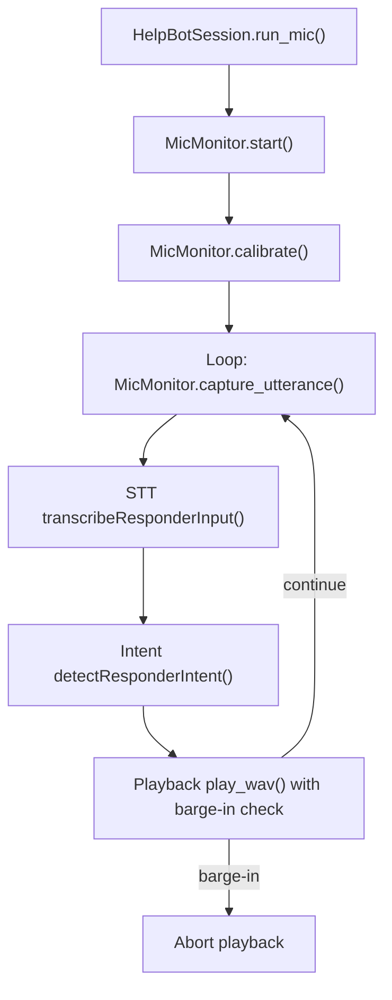
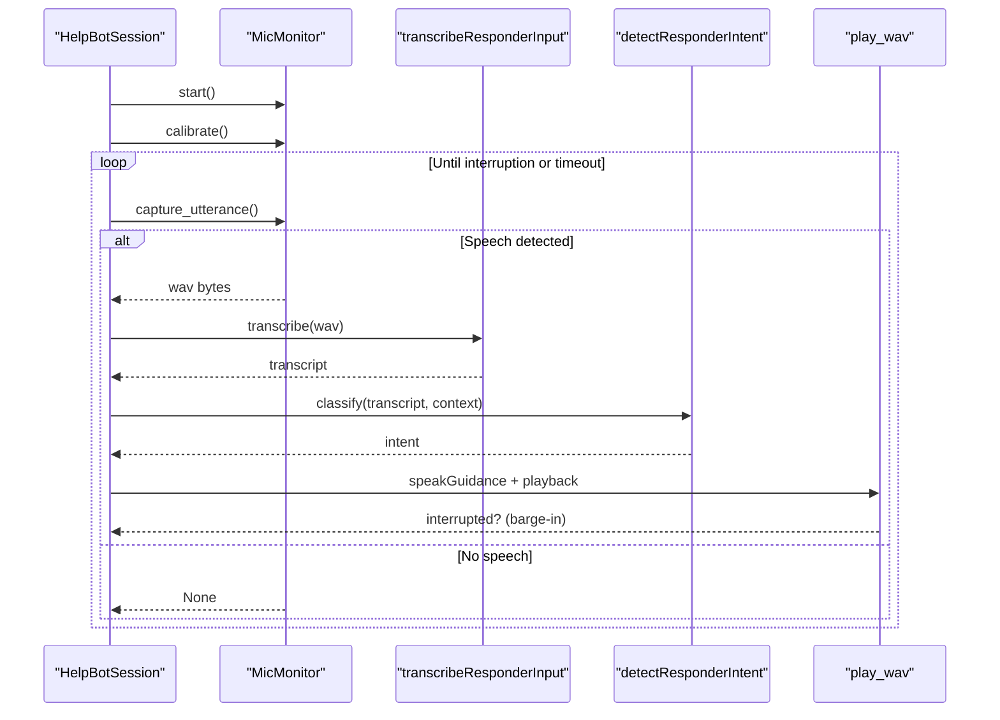
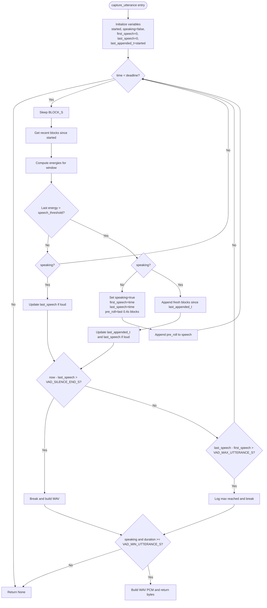
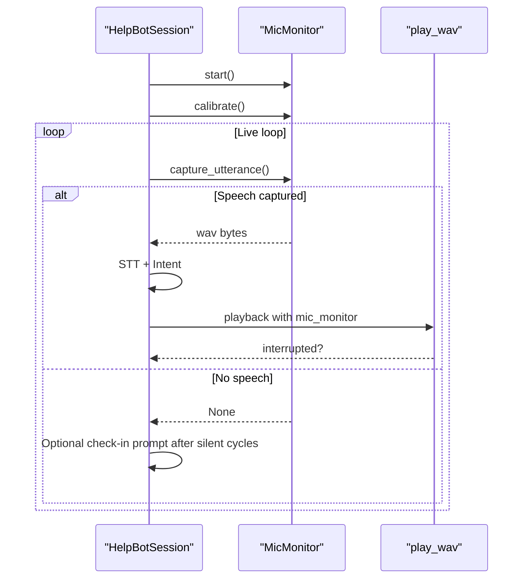
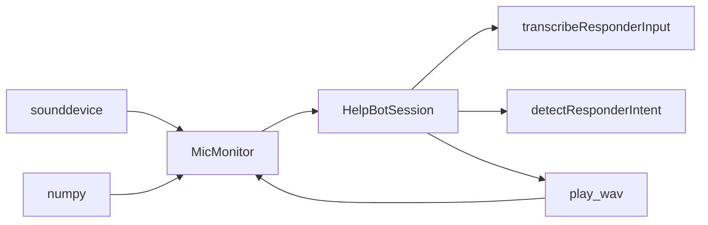

# Voice Activity Detection (VAD)

<cite>
**Referenced Files in This Document**
- [help_bot_service.py](file://backend/services/help_bot_service.py)
</cite>

## Table of Contents
1. [Introduction](#introduction)
2. [Project Structure](#project-structure)
3. [Core Components](#core-components)
4. [Architecture Overview](#architecture-overview)
5. [Detailed Component Analysis](#detailed-component-analysis)
6. [Dependency Analysis](#dependency-analysis)
7. [Performance Considerations](#performance-considerations)
8. [Troubleshooting Guide](#troubleshooting-guide)
9. [Conclusion](#conclusion)

## Introduction
This document explains the Voice Activity Detection (VAD) system used for energy-based speech detection and utterance segmentation. It focuses on the MicMonitor class that performs real-time audio capture at 16 kHz mono, computes per-block RMS amplitude to estimate energy, and adapts thresholds via a noise floor calibration step. The VAD uses configurable thresholds to segment utterances, including trailing silence duration, minimum utterance length, and maximum utterance length. It also supports barge-in detection during playback so the responder can interrupt guidance at any time.

## Project Structure
The VAD implementation is part of the backend service module that orchestrates live capture, STT, intent classification, TTS, and playback with barge-in. The key file contains:
- Audio I/O helpers and fallbacks when hardware is unavailable
- The MicMonitor class implementing continuous capture, energy calculation, calibration, and VAD-driven utterance segmentation
- Playback integration that checks for barge-in while playing bot responses

**Diagram sources**
- [help_bot_service.py:898-925](file://backend/services/help_bot_service.py#L898-L925)
- [help_bot_service.py:405-444](file://backend/services/help_bot_service.py#L405-L444)
- [help_bot_service.py:456-569](file://backend/services/help_bot_service.py#L456-L569)

**Section sources**
- [help_bot_service.py:390-444](file://backend/services/help_bot_service.py#L390-L444)
- [help_bot_service.py:456-569](file://backend/services/help_bot_service.py#L456-L569)
- [help_bot_service.py:898-925](file://backend/services/help_bot_service.py#L898-L925)

## Core Components
- MicMonitor: Real-time 16 kHz mono capture, RMS energy estimation, noise floor calibration, barge-in detection, and VAD-driven utterance segmentation.
- HelpBotSession.run_mic(): Orchestrates the live loop: start mic, calibrate, continuously capture utterances, run STT and intent, speak guidance, and handle barge-in.
- Audio I/O helpers: Lazy imports and best-effort playback with fallbacks when no audio device is present.

Key constants governing VAD behavior:
- MIC_SAMPLE_RATE = 16000 Hz
- VAD_SILENCE_END_S = 1.2 seconds trailing silence to end an utterance
- VAD_MIN_UTTERANCE_S = 0.35 seconds minimum utterance duration
- VAD_MAX_UTTERANCE_S = 15.0 seconds maximum utterance duration
- LISTEN_TIMEOUT_S = 20.0 seconds overall capture timeout
- BARGE_IN_HOLD_S = 0.35 seconds sustained speech required to interrupt playback
- BARGE_IN_FACTOR = 1.8 multiplier over speech threshold for barge-in detection

**Section sources**
- [help_bot_service.py:54-62](file://backend/services/help_bot_service.py#L54-L62)
- [help_bot_service.py:456-569](file://backend/services/help_bot_service.py#L456-L569)
- [help_bot_service.py:898-925](file://backend/services/help_bot_service.py#L898-L925)

## Architecture Overview
The VAD pipeline integrates tightly with the help bot session:
- Continuous capture: MicMonitor opens a 16 kHz mono input stream and buffers 50 ms blocks into a ring buffer.
- Energy calculation: Each block’s RMS amplitude is computed to estimate energy.
- Calibration: Noise floor is estimated from recent blocks; speech threshold is set above the noise floor.
- Utterance segmentation: capture_utterance transitions between silence and speech states using thresholds and timing rules.
- Barge-in: During playback, periodic checks detect sustained high-energy speech above a raised threshold to interrupt the bot.

**Diagram sources**
- [help_bot_service.py:898-925](file://backend/services/help_bot_service.py#L898-L925)
- [help_bot_service.py:456-569](file://backend/services/help_bot_service.py#L456-L569)
- [help_bot_service.py:405-444](file://backend/services/help_bot_service.py#L405-L444)

## Detailed Component Analysis

### MicMonitor: Real-Time Capture and VAD State Machine
MicMonitor implements:
- Continuous capture at 16 kHz mono with 50 ms blocks
- RMS energy computation per block
- Noise floor calibration and adaptive speech threshold
- Barge-in detection using a higher threshold over a short window
- VAD-driven utterance segmentation with pre-roll buffering and state transitions

**Diagram sources**
- [help_bot_service.py:521-569](file://backend/services/help_bot_service.py#L521-L569)

#### Key Implementation Details
- Block size: 50 ms at 16 kHz yields 800-sample blocks for efficient processing.
- Ring buffer: Maintains up to 30 seconds of blocks to support pre-roll and recent-window queries.
- Energy: RMS amplitude computed per block; small epsilon added for numerical stability.
- Calibration: Uses recent blocks to estimate noise floor; speech threshold is set to max(noise_floor * 2.5, fixed baseline).
- Pre-roll: Captures ~0.4 s before speech onset to avoid cutting initial phonemes.
- Termination conditions:
  - Trailing silence longer than VAD_SILENCE_END_S ends the utterance.
  - Maximum utterance length VAD_MAX_UTTERANCE_S prevents runaway captures.
  - Minimum utterance length VAD_MIN_UTTERANCE_S filters out noise bursts.

**Section sources**
- [help_bot_service.py:456-569](file://backend/services/help_bot_service.py#L456-L569)

### Noise Floor Calibration and Threshold Adaptation
Calibration measures ambient noise by sampling recent blocks and computing average energy. The speech threshold is derived from the noise floor with a safety margin and a minimum absolute value to avoid overly sensitive detection in quiet environments.

- Noise floor estimation: Average RMS energy across recent blocks.
- Speech threshold: max(noise_floor * 2.5, fixed baseline), ensuring robustness across varying acoustic environments.
- Logging: Calibration results are logged for observability.

Adaptation to different environments:
- In noisy settings, noise floor increases, raising the speech threshold accordingly.
- In quiet settings, the threshold remains bounded by the minimum baseline to prevent false positives.

**Section sources**
- [help_bot_service.py:498-507](file://backend/services/help_bot_service.py#L498-L507)

### Barge-In Detection
Barge-in allows the responder to interrupt playback by speaking loudly enough. Detection uses:
- A raised threshold: speech_threshold * BARGE_IN_FACTOR
- A sustained window: BARGE_IN_HOLD_S seconds
- A majority rule: a fraction of recent blocks must exceed the raised threshold

This approach mitigates false interruptions due to speaker echo without acoustic echo cancellation.

**Section sources**
- [help_bot_service.py:509-519](file://backend/services/help_bot_service.py#L509-L519)
- [help_bot_service.py:405-444](file://backend/services/help_bot_service.py#L405-L444)

### Integration with HelpBotSession
The live loop:
- Starts MicMonitor and calibrates noise floor
- Repeatedly calls capture_utterance to get segmented audio
- Runs STT and intent classification
- Speaks scripted guidance and plays audio
- Checks for barge-in during playback to abort early if needed

**Diagram sources**
- [help_bot_service.py:898-925](file://backend/services/help_bot_service.py#L898-L925)
- [help_bot_service.py:405-444](file://backend/services/help_bot_service.py#L405-L444)

**Section sources**
- [help_bot_service.py:898-925](file://backend/services/help_bot_service.py#L898-L925)

## Dependency Analysis
- MicMonitor depends on:
  - sounddevice for audio streaming
  - numpy for numeric operations
  - threading.Lock for thread-safe access to the ring buffer
- HelpBotSession depends on:
  - MicMonitor for capture and barge-in
  - STT and intent functions for processing
  - Playback function for TTS output with barge-in checks

**Diagram sources**
- [help_bot_service.py:390-444](file://backend/services/help_bot_service.py#L390-L444)
- [help_bot_service.py:456-569](file://backend/services/help_bot_service.py#L456-L569)
- [help_bot_service.py:898-925](file://backend/services/help_bot_service.py#L898-L925)

**Section sources**
- [help_bot_service.py:390-444](file://backend/services/help_bot_service.py#L390-L444)
- [help_bot_service.py:456-569](file://backend/services/help_bot_service.py#L456-L569)
- [help_bot_service.py:898-925](file://backend/services/help_bot_service.py#L898-L925)

## Performance Considerations
- Block size: 50 ms balances latency and CPU usage; suitable for resource-constrained devices.
- Ring buffer: Fixed-size deque limits memory usage to ~30 seconds of audio.
- RMS energy: Computed per block using vectorized operations; minimal overhead.
- Calibration: Short-duration measurement minimizes startup delay.
- Barge-in: Short window and majority rule reduce false positives while keeping responsiveness.
- Fallbacks: If audio stack is unavailable, playback returns False and the session continues with text-only mode; capture requires hardware and will raise an error if not available.

Recommendations:
- Adjust BLOCK_S for lower CPU usage on very constrained devices (e.g., 80–100 ms).
- Tune VAD_SILENCE_END_S and VAD_MIN_UTTERANCE_S based on environment noise characteristics.
- Use replay mode for deterministic testing when hardware is not available.

[No sources needed since this section provides general guidance]

## Troubleshooting Guide
Common issues and resolutions:
- No audio device:
  - Symptom: Playback fails and returns False; capture initialization raises an error.
  - Resolution: Ensure sounddevice is installed and accessible; otherwise use replay mode.
- Excessive false positives:
  - Symptom: Noise triggers speech detection.
  - Resolution: Increase calibration duration or adjust thresholds; verify microphone placement.
- Premature utterance termination:
  - Symptom: Utterances cut too early.
  - Resolution: Increase VAD_SILENCE_END_S slightly; ensure adequate pre-roll.
- Missed utterances:
  - Symptom: Weak speech not detected.
  - Resolution: Lower speech threshold or increase calibration sample size; check microphone gain.
- False barge-in:
  - Symptom: Playback interrupts unintentionally.
  - Resolution: Increase BARGE_IN_FACTOR or BARGE_IN_HOLD_S; improve speaker-mic isolation.

**Section sources**
- [help_bot_service.py:394-402](file://backend/services/help_bot_service.py#L394-L402)
- [help_bot_service.py:456-569](file://backend/services/help_bot_service.py#L456-L569)
- [help_bot_service.py:405-444](file://backend/services/help_bot_service.py#L405-L444)

## Conclusion
The VAD system provides robust, energy-based speech detection and utterance segmentation tailored for real-time voice interaction. MicMonitor captures audio at 16 kHz mono, computes RMS energy per block, and adapts thresholds via noise floor calibration. Configurable parameters enable tuning for diverse acoustic environments, while barge-in detection ensures responsive user control. The design includes practical fallbacks for headless or resource-constrained deployments, enabling reliable operation across a range of hardware capabilities.

[No sources needed since this section summarizes without analyzing specific files]