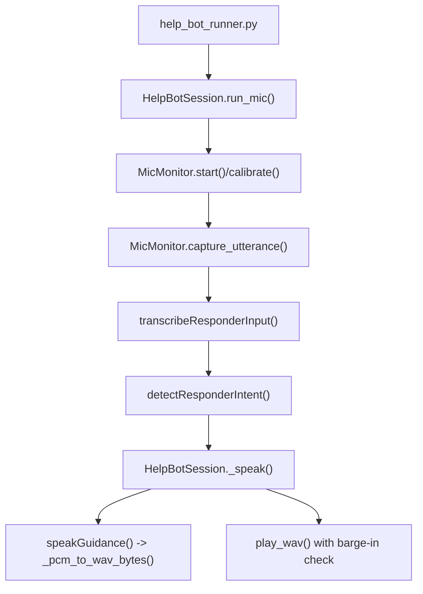
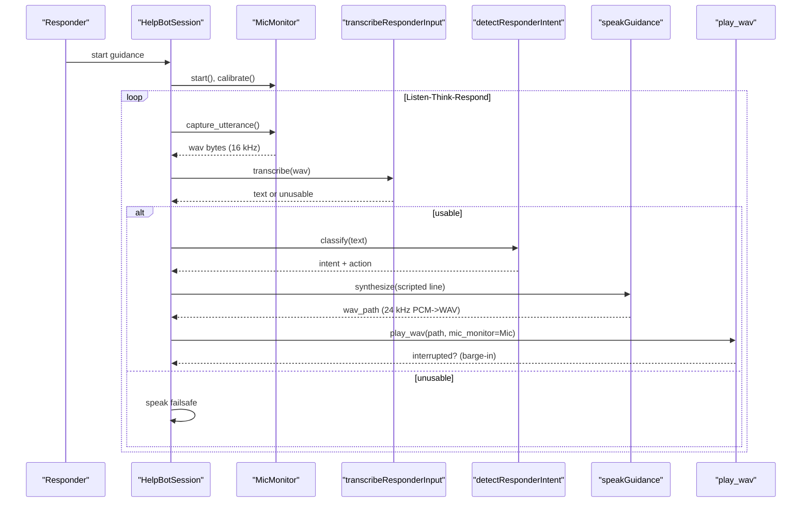
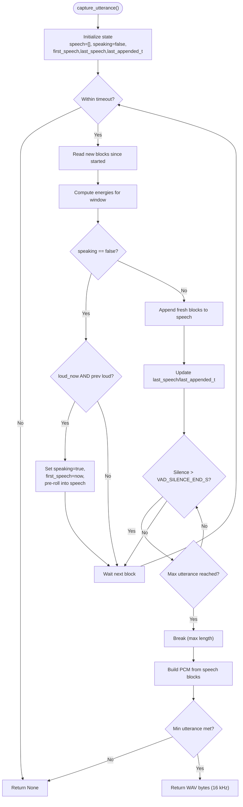
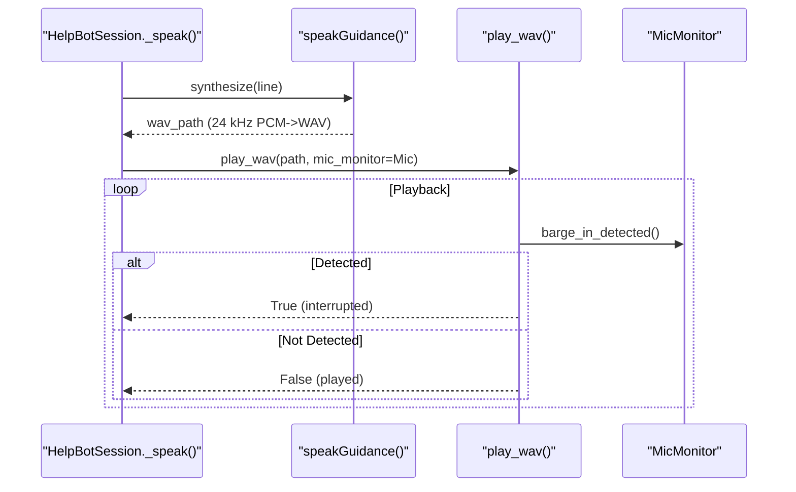
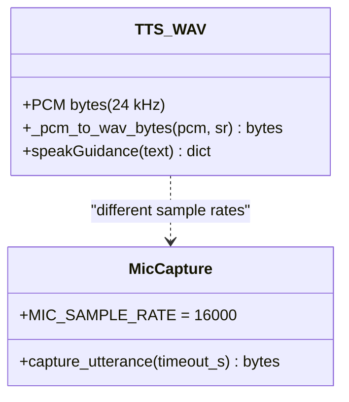
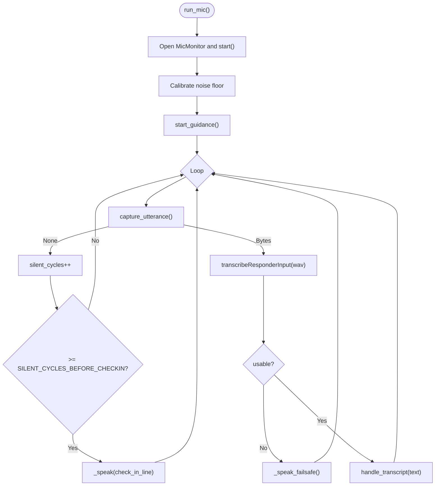
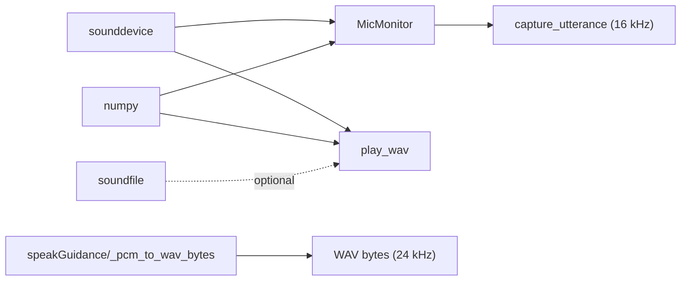

# Voice Processing & Audio I/O

<cite>
**Referenced Files in This Document**
- [help_bot_service.py](file://backend/services/help_bot_service.py)
- [help_bot_runner.py](file://backend/help_bot_runner.py)
</cite>

## Table of Contents
1. [Introduction](#introduction)
2. [Project Structure](#project-structure)
3. [Core Components](#core-components)
4. [Architecture Overview](#architecture-overview)
5. [Detailed Component Analysis](#detailed-component-analysis)
6. [Dependency Analysis](#dependency-analysis)
7. [Performance Considerations](#performance-considerations)
8. [Troubleshooting Guide](#troubleshooting-guide)
9. [Conclusion](#conclusion)
10. [Appendices](#appendices)

## Introduction
This document explains the voice processing and audio I/O subsystem that powers real-time microphone capture, voice activity detection (VAD), utterance segmentation, and barge-in functionality for a responder guidance bot. It focuses on the MicMonitor class implementation, VAD parameters, barge-in detection, audio capture workflows, WAV generation, sample rate handling between 16 kHz microphone input and 24 kHz TTS output, field audio quality considerations, hardware dependency handling, and fallback mechanisms when audio devices are unavailable.

## Project Structure
The voice/audio subsystem is implemented in the backend service module and orchestrated by the console runner:
- Service layer: audio capture, playback, VAD, barge-in, STT/TTS boundaries, session control
- Runner: CLI entrypoint to run replay or live mic mode, prewarm TTS cache, verify TTS round-trip

**Diagram sources**
- [help_bot_runner.py:175-236](file://backend/help_bot_runner.py#L175-L236)
- [help_bot_service.py:898-925](file://backend/services/help_bot_service.py#L898-L925)
- [help_bot_service.py:456-569](file://backend/services/help_bot_service.py#L456-L569)
- [help_bot_service.py:340-387](file://backend/services/help_bot_service.py#L340-L387)
- [help_bot_service.py:405-453](file://backend/services/help_bot_service.py#L405-L453)

**Section sources**
- [help_bot_runner.py:175-236](file://backend/help_bot_runner.py#L175-L236)
- [help_bot_service.py:390-453](file://backend/services/help_bot_service.py#L390-L453)

## Core Components
- MicMonitor: continuous 16 kHz mono capture, energy-based VAD, noise calibration, utterance segmentation, barge-in detection
- play_wav: best-effort playback with barge-in interruption
- speakGuidance/_pcm_to_wav_bytes: TTS PCM to WAV conversion and caching
- transcribeResponderInput/detectResponderIntent: STT and intent classification boundaries
- HelpBotSession.run_mic/run_replay: orchestration of live capture loop and deterministic replay

Key constants:
- MIC_SAMPLE_RATE = 16000 Hz
- TTS_SAMPLE_RATE = 24000 Hz
- VAD_SILENCE_END_S = 1.2 s
- VAD_MIN_UTTERANCE_S = 0.35 s
- VAD_MAX_UTTERANCE_S = 15.0 s
- LISTEN_TIMEOUT_S = 20.0 s
- BARGE_IN_HOLD_S = 0.35 s
- BARGE_IN_FACTOR = 1.8

**Section sources**
- [help_bot_service.py:51-62](file://backend/services/help_bot_service.py#L51-L62)
- [help_bot_service.py:456-569](file://backend/services/help_bot_service.py#L456-L569)
- [help_bot_service.py:340-387](file://backend/services/help_bot_service.py#L340-L387)
- [help_bot_service.py:405-453](file://backend/services/help_bot_service.py#L405-L453)
- [help_bot_service.py:898-925](file://backend/services/help_bot_service.py#L898-L925)

## Architecture Overview
The system implements a continuous listen-think-respond loop:
- Live mode opens a microphone stream, calibrates noise floor, then repeatedly captures utterances using VAD
- Each captured utterance is sent to STT; if usable, intent is classified and scripted responses are spoken via TTS
- During playback, barge-in detection can interrupt the speaker if sustained speech is detected above a raised threshold
- TTS outputs PCM at 24 kHz; WAV files are generated for caching and playback
- If audio hardware is unavailable, the system falls back to transcript-only operation and logs warnings

**Diagram sources**
- [help_bot_service.py:898-925](file://backend/services/help_bot_service.py#L898-L925)
- [help_bot_service.py:456-569](file://backend/services/help_bot_service.py#L456-L569)
- [help_bot_service.py:340-387](file://backend/services/help_bot_service.py#L340-L387)
- [help_bot_service.py:405-453](file://backend/services/help_bot_service.py#L405-L453)

## Detailed Component Analysis

### MicMonitor: Real-Time Capture, VAD, and Barge-In
MicMonitor provides:
- Continuous 16 kHz mono capture via an InputStream callback storing timestamped blocks in a ring buffer
- Energy-based VAD: computes RMS-like energy per block to detect speech vs silence
- Noise calibration: measures ambient noise over a short window and sets a speech threshold above the noise floor
- Utterance segmentation: starts capturing when two consecutive blocks exceed threshold, includes a small pre-roll, ends after silence longer than a threshold or max utterance length
- Barge-in detection: checks recent blocks for sustained high-energy events above a raised threshold to interrupt playback

**Diagram sources**
- [help_bot_service.py:521-569](file://backend/services/help_bot_service.py#L521-L569)

Key behaviors and parameters:
- BLOCK_S = 0.05 s (800 samples at 16 kHz)
- Noise calibration uses recent blocks to compute noise_floor and speech_threshold = max(noise_floor * 2.5, 400.0)
- Barge-in detection uses BARGE_IN_HOLD_S window and BARGE_IN_FACTOR to raise threshold against speaker echo
- Utterance segmentation uses VAD_SILENCE_END_S, VAD_MIN_UTTERANCE_S, VAD_MAX_UTTERANCE_S

**Section sources**
- [help_bot_service.py:456-569](file://backend/services/help_bot_service.py#L456-L569)
- [help_bot_service.py:51-62](file://backend/services/help_bot_service.py#L51-L62)

### Playback and Barge-In Interruption
play_wav reads WAV data and streams it via an OutputStream callback. While playing, it periodically checks MicMonitor.barge_in_detected(). If true, playback is aborted and the function returns True to signal interruption.

**Diagram sources**
- [help_bot_service.py:405-453](file://backend/services/help_bot_service.py#L405-L453)
- [help_bot_service.py:727-750](file://backend/services/help_bot_service.py#L727-L750)

**Section sources**
- [help_bot_service.py:405-453](file://backend/services/help_bot_service.py#L405-L453)
- [help_bot_service.py:727-750](file://backend/services/help_bot_service.py#L727-L750)

### TTS PCM to WAV Conversion and Sample Rates
- TTS produces raw PCM at 24 kHz (mono, 16-bit). The helper converts PCM to WAV bytes with correct headers
- WAV files are cached to disk to avoid repeated synthesis and to enable deterministic runs
- Microphone capture operates at 16 kHz; STT consumes these WAV bytes directly without resampling in this code path

**Diagram sources**
- [help_bot_service.py:340-387](file://backend/services/help_bot_service.py#L340-L387)
- [help_bot_service.py:521-569](file://backend/services/help_bot_service.py#L521-L569)

**Section sources**
- [help_bot_service.py:340-387](file://backend/services/help_bot_service.py#L340-L387)
- [help_bot_service.py:51-62](file://backend/services/help_bot_service.py#L51-L62)

### Live Capture Workflow (run_mic)
The live mode orchestrates:
- Initialize MicMonitor and start streaming
- Calibrate noise floor
- Deliver initial guidance
- Repeatedly capture utterances, send to STT, handle intents, and speak responses
- Periodically check in if silent cycles accumulate
- Gracefully stop mic on exit

**Diagram sources**
- [help_bot_service.py:898-925](file://backend/services/help_bot_service.py#L898-L925)

**Section sources**
- [help_bot_service.py:898-925](file://backend/services/help_bot_service.py#L898-L925)

### Replay Mode and Deterministic Testing
Replay mode executes scripted turns, optionally exercising real STT paths with provided audio files, while always using cached TTS audio for deterministic behavior.

**Section sources**
- [help_bot_service.py:878-896](file://backend/services/help_bot_service.py#L878-L896)
- [help_bot_runner.py:175-236](file://backend/help_bot_runner.py#L175-L236)

## Dependency Analysis
- Audio stack dependencies (sounddevice, numpy, soundfile) are lazily imported; if unavailable, playback/capture gracefully degrade
- MicMonitor depends on sounddevice for InputStream; play_wav depends on sounddevice for OutputStream
- TTS path depends on provider-specific implementations behind a boundary; PCM to WAV conversion is self-contained
- Session logic depends on STT and intent classification boundaries but remains decoupled from provider details

**Diagram sources**
- [help_bot_service.py:390-453](file://backend/services/help_bot_service.py#L390-L453)
- [help_bot_service.py:456-569](file://backend/services/help_bot_service.py#L456-L569)
- [help_bot_service.py:340-387](file://backend/services/help_bot_service.py#L340-L387)

**Section sources**
- [help_bot_service.py:390-453](file://backend/services/help_bot_service.py#L390-L453)

## Performance Considerations
- Block size: 0.05 s (800 samples at 16 kHz) balances responsiveness and CPU overhead
- Ring buffer: 30-second history supports barge-in detection windows without excessive memory use
- VAD thresholds: calibrated per session to adapt to environment noise; speech_threshold uses a multiplier and absolute minimum to reduce false positives
- Barge-in detection: requires sustained high-energy blocks within a short window to avoid accidental interruptions from transient noise or speaker echo
- TTS caching: reduces latency and quota usage; first playback delay measured for user-perceived latency
- Sample rates: keep 16 kHz for mic capture and 24 kHz for TTS; no explicit resampling in this code path

[No sources needed since this section provides general guidance]

## Troubleshooting Guide
Common issues and mitigations:
- No audio device available:
  - Audio stack imports fail; playback/capture return early with warnings; transcript and saved WAV still evidence the run
  - Use replay mode to validate logic without hardware
- Excessive false barge-in:
  - Raised barge-in threshold helps mitigate speaker echo; ensure adequate distance between speaker and mic
  - In noisy environments, re-run calibration before starting
- Short or missed utterances:
  - Ensure VAD_MIN_UTTERANCE_S is met; adjust listening timeout if necessary
  - Verify that capture_utterance receives enough blocks to form a valid utterance
- STT failures:
  - Unusable transcripts trigger failsafe lines; continue loop to maintain conversation flow
- Latency spikes:
  - First playback delay is tracked; prewarming TTS cache minimizes cold-start delays

**Section sources**
- [help_bot_service.py:390-453](file://backend/services/help_bot_service.py#L390-L453)
- [help_bot_service.py:727-750](file://backend/services/help_bot_service.py#L727-L750)
- [help_bot_service.py:898-925](file://backend/services/help_bot_service.py#L898-L925)

## Conclusion
The voice processing subsystem delivers robust real-time capture, adaptive VAD, and reliable barge-in detection tailored for field conditions. By separating concerns—capture, segmentation, STT/intent boundaries, TTS conversion, and playback—the system remains resilient to hardware variability and network constraints. Calibration and conservative thresholds help maintain usability across diverse acoustic environments, while caching and replay modes support deterministic testing and rapid iteration.

[No sources needed since this section summarizes without analyzing specific files]

## Appendices

### VAD Parameters Reference
- VAD_SILENCE_END_S: trailing silence duration to end an utterance
- VAD_MIN_UTTERANCE_S: minimum utterance length required to accept a capture
- VAD_MAX_UTTERANCE_S: maximum utterance length before cutting
- LISTEN_TIMEOUT_S: maximum time to wait for an utterance
- BARGE_IN_HOLD_S: sustained speech window for barge-in detection
- BARGE_IN_FACTOR: multiplier applied to speech threshold for barge-in to tolerate speaker echo

**Section sources**
- [help_bot_service.py:51-62](file://backend/services/help_bot_service.py#L51-L62)

### Audio Quality Variations and Hardware Dependencies
- Field conditions may introduce background noise, reverberation, or variable mic sensitivity; calibration adapts thresholds per session
- Hardware dependency handling ensures the system continues operating in headless environments by falling back to transcript-only and logging warnings
- When devices are unavailable, replay mode remains fully functional for validation

**Section sources**
- [help_bot_service.py:390-453](file://backend/services/help_bot_service.py#L390-L453)
- [help_bot_service.py:898-925](file://backend/services/help_bot_service.py#L898-L925)