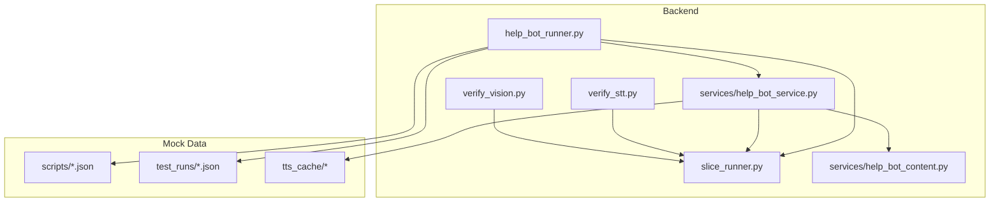
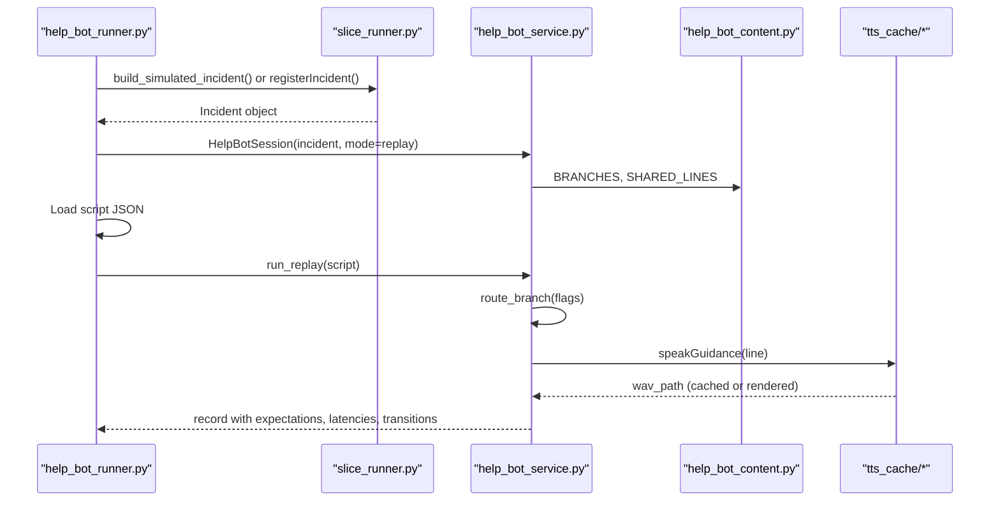
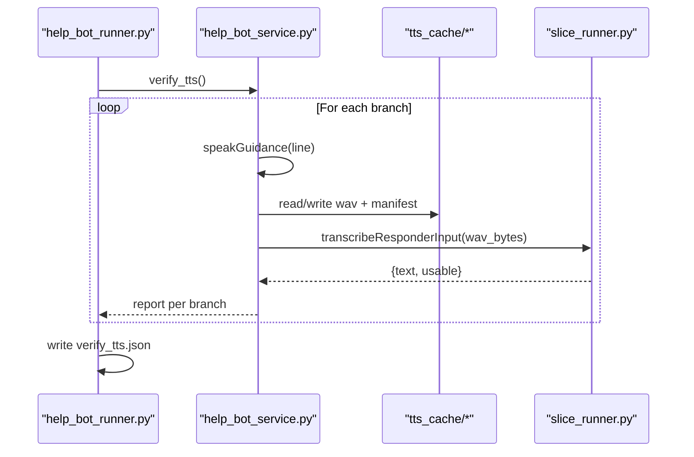
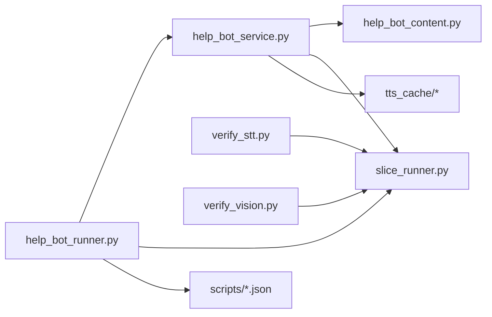

# Testing & Simulation Framework

<cite>
**Referenced Files in This Document**
- [help_bot_runner.py](file://backend/help_bot_runner.py)
- [slice_runner.py](file://backend/slice_runner.py)
- [help_bot_service.py](file://backend/services/help_bot_service.py)
- [help_bot_content.py](file://backend/services/help_bot_content.py)
- [verify_stt.py](file://backend/verify_stt.py)
- [verify_vision.py](file://backend/verify_vision.py)
- [heavy_bleeding.json](file://mockdata/helpbot/scripts/heavy_bleeding.json)
- [fracture_crush.json](file://mockdata/helpbot/scripts/fracture_crush.json)
- [snakebite.json](file://mockdata/helpbot/scripts/snakebite.json)
- [verify_tts.json](file://mockdata/helpbot/test_runs/verify_tts.json)
</cite>

## Table of Contents
1. [Introduction](#introduction)
2. [Project Structure](#project-structure)
3. [Core Components](#core-components)
4. [Architecture Overview](#architecture-overview)
5. [Detailed Component Analysis](#detailed-component-analysis)
6. [Dependency Analysis](#dependency-analysis)
7. [Performance Considerations](#performance-considerations)
8. [Troubleshooting Guide](#troubleshooting-guide)
9. [Conclusion](#conclusion)
10. [Appendices](#appendices)

## Introduction
This document explains the Testing & Simulation Framework for scenario replay and system validation in the LifeLine Ride emergency response system. It focuses on:
- Deterministic replay of help bot conversations using scripted scenarios
- Mock data management for emergency scenarios (triage, media, scripts)
- TTS verification via spoken-Urdu round-trip checks
- Automated testing workflows and result validation
- Performance benchmarking and debugging techniques
- Best practices for creating new test scenarios

The framework supports both Module 1 triage simulation and Module 2 help-bot conversation flows, enabling repeatable, quota-friendly tests with clear pass/fail outcomes.

## Project Structure
The testing and simulation capabilities are implemented across backend runners, services, and mock data:
- Runners orchestrate test execution modes (simulate, pipeline, replay, mic, verify-tts)
- Services implement the help-bot session engine, provider boundaries (STT/intent/TTS), and escalation hooks
- Slice runner provides triage pipeline, dispatch logic, seed data, and a built-in vertical slice test suite
- Verify scripts validate STT and vision components against real media
- Mock data includes scenario scripts, test run outputs, and TTS cache manifests

**Diagram sources**
- [help_bot_runner.py:175-236](file://backend/help_bot_runner.py#L175-L236)
- [slice_runner.py:589-672](file://backend/slice_runner.py#L589-L672)
- [help_bot_service.py:663-783](file://backend/services/help_bot_service.py#L663-L783)
- [help_bot_content.py:21-43](file://backend/services/help_bot_content.py#L21-L43)
- [verify_stt.py:22-52](file://backend/verify_stt.py#L22-L52)
- [verify_vision.py:22-49](file://backend/verify_vision.py#L22-L49)

**Section sources**
- [help_bot_runner.py:1-241](file://backend/help_bot_runner.py#L1-L241)
- [slice_runner.py:1-745](file://backend/slice_runner.py#L1-L745)
- [help_bot_service.py:1-960](file://backend/services/help_bot_service.py#L1-L960)
- [help_bot_content.py:1-255](file://backend/services/help_bot_content.py#L1-L255)
- [verify_stt.py:1-61](file://backend/verify_stt.py#L1-L61)
- [verify_vision.py:1-58](file://backend/verify_vision.py#L1-L58)

## Core Components
- Scenario Replay Runner: Builds incidents from seed data or runs full triage pipeline, then executes help-bot sessions in replay mode with deterministic scripts.
- Help Bot Session Engine: Implements state machine, scripted content, provider-boundary STT/intent/TTS, barge-in playback, and escalation hook.
- Triage Pipeline: STT, vision classification, classifier combination, caching, and fail-safe behavior; also exposes a vertical slice test suite.
- Verification Scripts: STT accuracy check and injury classification verification against real media.
- Mock Data: Scripted conversation turns per branch, TTS cache manifest, and test run outputs capturing expectations, latencies, and transitions.

Key responsibilities:
- Deterministic replay ensures consistent intent classification and scripted responses without live audio input.
- Provider boundaries isolate AI calls (Gemini/DashScope) behind timeouts and retries, ensuring robustness.
- TTS caching avoids quota consumption during repeated tests and enables spoken-Urdu round-trip verification.

**Section sources**
- [help_bot_runner.py:74-99](file://backend/help_bot_runner.py#L74-L99)
- [help_bot_service.py:663-783](file://backend/services/help_bot_service.py#L663-L783)
- [slice_runner.py:519-587](file://backend/slice_runner.py#L519-L587)
- [verify_stt.py:22-52](file://backend/verify_stt.py#L22-L52)
- [verify_vision.py:22-49](file://backend/verify_vision.py#L22-L49)

## Architecture Overview
The testing framework composes three layers:
- Orchestration layer: CLI entrypoints that select simulate/pipeline/replay/mic modes and load scripts.
- Service layer: Help-bot session engine driving scripted guidance, intent classification, and TTS output.
- Triage layer: STT/vision/classifier pipeline with caching and fail-safe defaults.

**Diagram sources**
- [help_bot_runner.py:175-236](file://backend/help_bot_runner.py#L175-L236)
- [help_bot_service.py:110-116](file://backend/services/help_bot_service.py#L110-L116)
- [help_bot_service.py:368-387](file://backend/services/help_bot_service.py#L368-L387)
- [help_bot_content.py:21-43](file://backend/services/help_bot_content.py#L21-L43)

## Detailed Component Analysis

### Scenario Replay Execution Workflow
- The runner builds an incident either from simulated flags/tier or by running the triage pipeline on mock media.
- In replay mode, it loads a script JSON defining expected responder turns and intents.
- The session executes scripted turns, classifies intents, speaks scripted Urdu lines, and records outcomes.
- Outputs include expectation matches, latency metrics, and transition logs for auditability.

**Diagram sources**
- [help_bot_runner.py:175-236](file://backend/help_bot_runner.py#L175-L236)
- [help_bot_service.py:663-783](file://backend/services/help_bot_service.py#L663-L783)

**Section sources**
- [help_bot_runner.py:74-99](file://backend/help_bot_runner.py#L74-L99)
- [help_bot_runner.py:175-236](file://backend/help_bot_runner.py#L175-L236)
- [help_bot_service.py:663-783](file://backend/services/help_bot_service.py#L663-L783)

### Mock Data Management for Emergency Scenarios
- Scripts define turn sequences with expected intents per branch (heavy_bleeding, fracture_crush, snakebite).
- Test run outputs capture full transcripts, expectations vs actual intents, latency breakdowns, and state transitions.
- TTS cache stores rendered audio files keyed by voice+text, with a manifest tracking provenance.

Examples:
- heavy_bleeding script defines step_done, in_scope_question, out_of_scope, and escalation turns.
- verify_tts.json captures source line, note, wav path, roundtrip transcript, and usability flag per branch.

**Section sources**
- [heavy_bleeding.json:1-11](file://mockdata/helpbot/scripts/heavy_bleeding.json#L1-L11)
- [fracture_crush.json:1-11](file://mockdata/helpbot/scripts/fracture_crush.json#L1-L11)
- [snakebite.json:1-11](file://mockdata/helpbot/scripts/snakebite.json#L1-L11)
- [verify_tts.json:1-23](file://mockdata/helpbot/test_runs/verify_tts.json#L1-L23)

### TTS Verification Processes
- prewarm_tts renders all scripted lines into the TTS cache to avoid quota usage during replay runs.
- verify_tts performs a spoken-Urdu round-trip: TTS -> audio file -> STT -> transcript comparison per branch.
- Outputs include notes when branch-specific audio is not yet rendered due to quota constraints.

**Diagram sources**
- [help_bot_runner.py:102-172](file://backend/help_bot_runner.py#L102-L172)
- [help_bot_service.py:368-387](file://backend/services/help_bot_service.py#L368-L387)
- [help_bot_service.py:159-167](file://backend/services/help_bot_service.py#L159-L167)

**Section sources**
- [help_bot_runner.py:102-172](file://backend/help_bot_runner.py#L102-L172)
- [help_bot_service.py:368-387](file://backend/services/help_bot_service.py#L368-L387)

### Automated Testing of Help Bot Conversations
- The runner supports --mode replay with a script JSON path to deterministically drive the session.
- Each turn’s expected intent is validated against the actual classified intent, producing match results.
- Latency metrics track detect_ms and respond_ms per turn, with summary statistics.

Validation procedures:
- Expectation matching: compare expected intent from script with actual intent classification.
- Transition logging: branch_entered, step_started, steps_complete, escalation events recorded with timestamps.
- Outcome reporting: final tier, escalation count, and overall expectation summary.

**Section sources**
- [help_bot_runner.py:175-236](file://backend/help_bot_runner.py#L175-L236)
- [help_bot_service.py:696-711](file://backend/services/help_bot_service.py#L696-L711)
- [help_bot_service.py:760-783](file://backend/services/help_bot_service.py#L760-L783)

### Performance Benchmarking Capabilities
- Latency measurement: first playback delay tracked per turn; per-turn detect and respond times recorded.
- Summary statistics: min, max, avg latency across turns for quick performance assessment.
- Quota-friendly runs: TTS prewarming and caching ensure deterministic, low-latency replays without burning quotas.

Best practices:
- Use replay mode for stable benchmarks; mic mode introduces variability.
- Pre-warm TTS before benchmark runs to eliminate network variance.
- Monitor latency summaries to identify regressions in intent detection or TTS rendering.

**Section sources**
- [help_bot_service.py:727-750](file://backend/services/help_bot_service.py#L727-L750)
- [help_bot_runner.py:230-235](file://backend/help_bot_runner.py#L230-L235)

### Integration with CI/CD Pipelines for Automated Testing
Recommended pipeline stages:
- Setup: Install dependencies, configure environment variables (API keys, provider selection).
- STT Verification: Run verify_stt.py to validate transcription quality against ground truth sidecars.
- Vision Verification: Run verify_vision.py to validate injury classification and image usability.
- TTS Prewarm: Execute prewarm_tts to populate tts_cache for deterministic replay runs.
- Replay Tests: Run help_bot_runner.py with --mode replay for each scenario script; assert expectation_summary indicates full matches.
- Reporting: Collect test run JSON artifacts (expectations, latencies, transitions) for analysis and auditing.

Notes:
- Use TRIAGE_AI_PROVIDER to switch between Gemini and DashScope for provider coverage.
- Handle failures gracefully: STT/Vision scripts return non-zero exit codes on failures; replay tests should assert pass conditions.

[No sources needed since this section provides general guidance]

### Debugging Techniques for Test Failures
- Inspect test run JSON: review expectations, actual intents, latencies, and transitions to pinpoint mismatches.
- Check TTS cache manifest: confirm which model/voice rendered each audio file and when.
- Review provider logs: look for TRIAGE WARN messages indicating STT/vision/classifier failures.
- Validate scripts: ensure turn transcripts align with branch Q&A hints and escalation signals.

Common issues:
- Empty transcripts: STT failed or unusable audio; verify media paths and provider availability.
- Intent mismatches: unclear transcripts or ambiguous prompts; refine scripts or adjust provider settings.
- TTS quota exhaustion: use prewarm_tts to avoid runtime rendering under quota limits.

**Section sources**
- [slice_runner.py:56-95](file://backend/slice_runner.py#L56-L95)
- [help_bot_service.py:82-87](file://backend/services/help_bot_service.py#L82-L87)
- [verify_stt.py:22-52](file://backend/verify_stt.py#L22-L52)
- [verify_vision.py:22-49](file://backend/verify_vision.py#L22-L49)

### Best Practices for Creating New Test Scenarios
- Define clear turn sequences with expected intents aligned to branch Q&A entries and escalation signals.
- Include edge cases: out-of-scope questions, unclear inputs, and escalation triggers.
- Validate scripts against existing branches: ensure keywords match injury_type_flags for correct routing.
- Add sidecar ground truths for STT verification where applicable.
- Update TTS cache after adding new scripted lines to maintain deterministic runs.

**Section sources**
- [heavy_bleeding.json:1-11](file://mockdata/helpbot/scripts/heavy_bleeding.json#L1-L11)
- [help_bot_content.py:46-255](file://backend/services/help_bot_content.py#L46-L255)
- [help_bot_service.py:99-116](file://backend/services/help_bot_service.py#L99-L116)

## Dependency Analysis
The testing framework has clear separation of concerns:
- Runners depend on services and slice runner for orchestration.
- Services depend on content definitions and provider boundaries.
- Verification scripts depend on slice runner for STT and vision.
- Mock data is consumed by runners and services for deterministic execution.

**Diagram sources**
- [help_bot_runner.py:175-236](file://backend/help_bot_runner.py#L175-L236)
- [help_bot_service.py:663-783](file://backend/services/help_bot_service.py#L663-L783)
- [verify_stt.py:22-52](file://backend/verify_stt.py#L22-L52)
- [verify_vision.py:22-49](file://backend/verify_vision.py#L22-L49)

**Section sources**
- [help_bot_runner.py:1-241](file://backend/help_bot_runner.py#L1-L241)
- [help_bot_service.py:1-960](file://backend/services/help_bot_service.py#L1-L960)
- [slice_runner.py:1-745](file://backend/slice_runner.py#L1-L745)

## Performance Considerations
- Use replay mode for stable, deterministic benchmarks; mic mode introduces hardware variability.
- Pre-warm TTS to avoid quota-related delays and ensure consistent latency measurements.
- Monitor latency summaries to detect regressions in intent detection or TTS rendering.
- Leverage triage caching to reduce repeated AI calls and improve repeatability.

[No sources needed since this section provides general guidance]

## Troubleshooting Guide
- STT failures: Check verify_stt.py output and provider logs; ensure audio files exist and are readable.
- Vision failures: Check verify_vision.py output; confirm image formats and provider availability.
- Intent mismatches: Review script transcripts and branch Q&A hints; consider adjusting provider prompts or timeout settings.
- TTS quota issues: Run prewarm_tts to populate cache; verify manifest for provenance and timestamps.

**Section sources**
- [verify_stt.py:22-52](file://backend/verify_stt.py#L22-L52)
- [verify_vision.py:22-49](file://backend/verify_vision.py#L22-L49)
- [help_bot_runner.py:102-172](file://backend/help_bot_runner.py#L102-L172)

## Conclusion
The Testing & Simulation Framework provides robust tools for scenario replay, mock data management, and TTS verification. It supports automated testing workflows, performance benchmarking, and debugging techniques essential for continuous validation of system behavior. By following best practices and leveraging the provided scripts and outputs, teams can create reliable test scenarios and maintain confidence in the emergency response system’s functionality.

[No sources needed since this section summarizes without analyzing specific files]

## Appendices

### Example Test Scenario Definition
- heavy_bleeding.json defines a sequence of turns with expected intents: step_done, in_scope_question, out_of_scope, escalation.
- Each turn includes Urdu text representing responder input and the expected classification outcome.

**Section sources**
- [heavy_bleeding.json:1-11](file://mockdata/helpbot/scripts/heavy_bleeding.json#L1-L11)

### Example Execution Workflow
- Run help_bot_runner.py with --simulate and --mode replay to execute scripted scenarios.
- Load script JSON and process turns through the help-bot session engine.
- Record expectations, latencies, and transitions for validation and auditing.

**Section sources**
- [help_bot_runner.py:175-236](file://backend/help_bot_runner.py#L175-L236)
- [help_bot_service.py:663-783](file://backend/services/help_bot_service.py#L663-L783)

### Example Result Validation Procedures
- Compare expected intents from scripts with actual intents classified by the session engine.
- Review latency summaries and transition logs to assess performance and state changes.
- Validate TTS round-trip transcripts for spoken-Urdu accuracy and usability.

**Section sources**
- [verify_tts.json:1-23](file://mockdata/helpbot/test_runs/verify_tts.json#L1-L23)
- [help_bot_runner.py:230-235](file://backend/help_bot_runner.py#L230-L235)