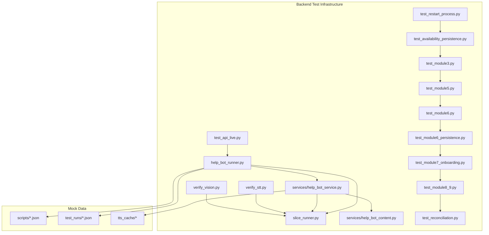
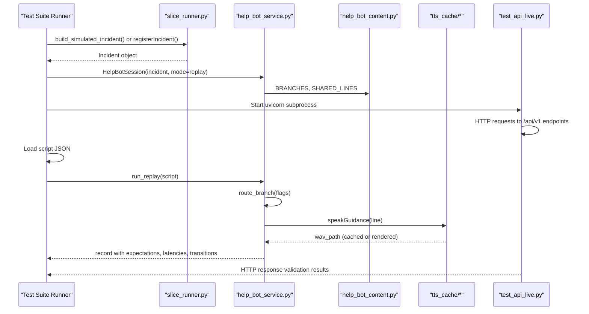
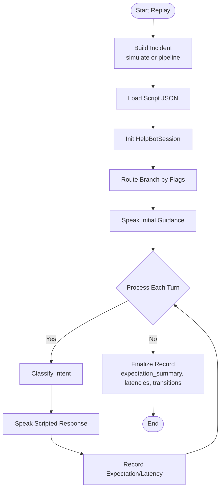
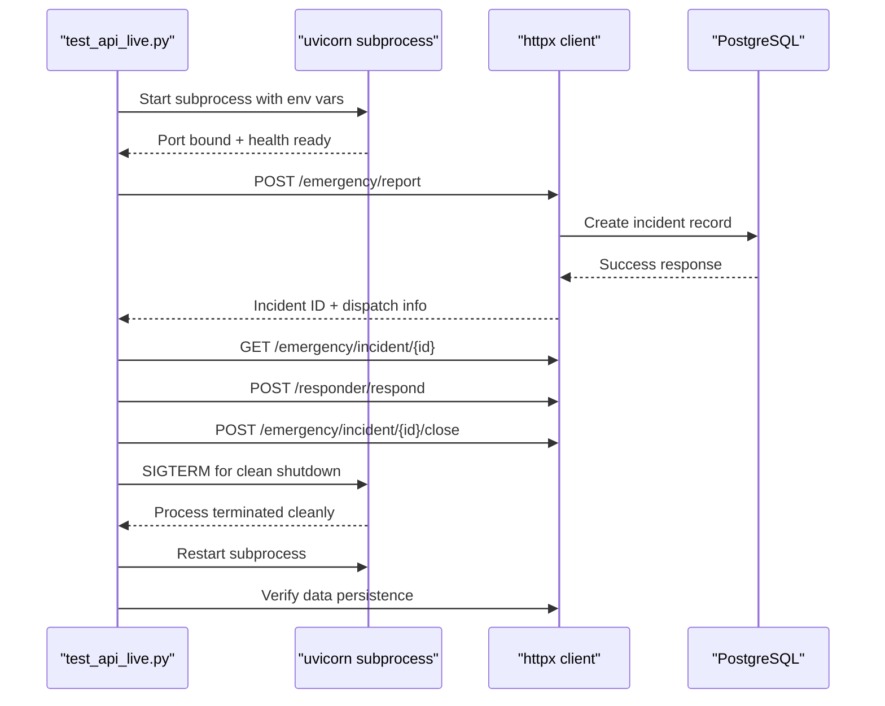
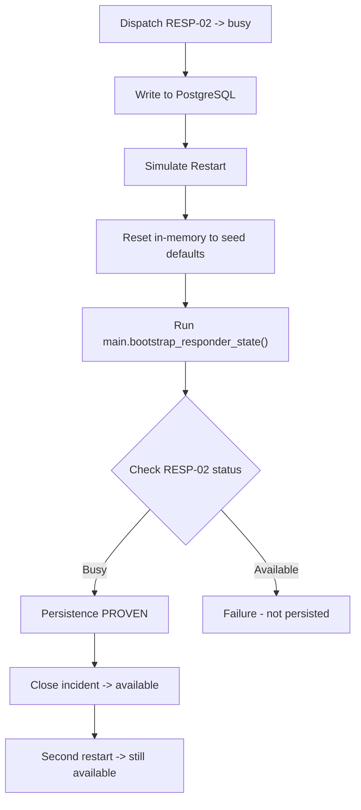
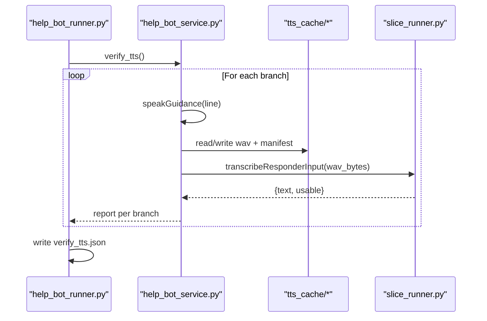
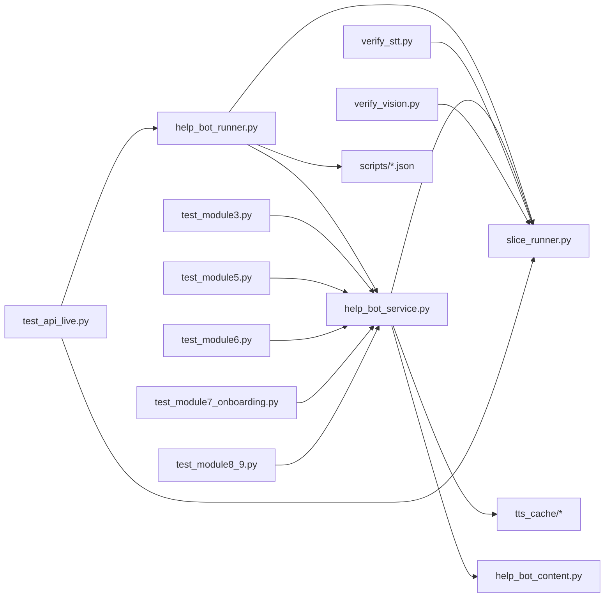

# Testing & Simulation Framework

<cite>
**Referenced Files in This Document**
- [help_bot_runner.py](file://backend/help_bot_runner.py)
- [slice_runner.py](file://backend/slice_runner.py)
- [help_bot_service.py](file://backend/services/help_bot_service.py)
- [help_bot_content.py](file://backend/services/help_bot_content.py)
- [verify_stt.py](file://backend/verify_stt.py)
- [verify_vision.py](file://backend/verify_vision.py)
- [test_api_live.py](file://backend/test_api_live.py)
- [test_availability_persistence.py](file://backend/test_availability_persistence.py)
- [test_restart_process.py](file://backend/test_restart_process.py)
- [test_module3.py](file://backend/test_module3.py)
- [test_module5.py](file://backend/test_module5.py)
- [test_module6.py](file://backend/test_module6.py)
- [test_module6_persistence.py](file://backend/test_module6_persistence.py)
- [test_module7_onboarding.py](file://backend/test_module7_onboarding.py)
- [test_module8_9.py](file://backend/test_module8_9.py)
- [test_reconciliation.py](file://backend/test_reconciliation.py)
- [heavy_bleeding.json](file://mockdata/helpbot/scripts/heavy_bleeding.json)
- [fracture_crush.json](file://mockdata/helpbot/scripts/fracture_crush.json)
- [snakebite.json](file://mockdata/helpbot/scripts/snakebite.json)
- [verify_tts.json](file://mockdata/helpbot/test_runs/verify_tts.json)
</cite>

## Update Summary
**Changes Made**
- Added comprehensive test infrastructure documentation covering module functionality, availability persistence, restart processes, and API verification
- Expanded mock data generation scripts and complete emergency response workflow testing
- Integrated new test suites for modules 3-9 with detailed scenario coverage
- Enhanced CI/CD pipeline integration with live API regression testing
- Added restart survival testing across process boundaries with PostgreSQL persistence validation
- Documented onboarding, verification, and dynamic registration testing workflows

## Table of Contents
1. [Introduction](#introduction)
2. [Project Structure](#project-structure)
3. [Core Components](#core-components)
4. [Architecture Overview](#architecture-overview)
5. [Detailed Component Analysis](#detailed-component-analysis)
6. [Dependency Analysis](#dependency-analysis)
7. [Performance Considerations](#performance-considerations)
8. [Troubleshooting Guide](#troubleshooting-guide)
9. [Conclusion](#conclusion)
10. [Appendices](#appendices)

## Introduction
This document explains the expanded Testing & Simulation Framework for scenario replay and system validation in the LifeLine Ride emergency response system. The framework now includes comprehensive test coverage across multiple modules with deterministic replay capabilities, mock data management, TTS verification, and live API regression testing. It focuses on:
- Deterministic replay of help bot conversations using scripted scenarios
- Mock data management for emergency scenarios (triage, media, scripts)
- TTS verification via spoken-Urdu round-trip checks
- Live API regression testing with real uvicorn subprocesses
- Module-specific test suites covering dispatch, accountability, lifecycle, onboarding, and escalation
- Restart survival testing across process boundaries with PostgreSQL persistence
- Performance benchmarking and debugging techniques
- Best practices for creating new test scenarios

The framework supports both Module 1 triage simulation and Module 2 help-bot conversation flows, enabling repeatable, quota-friendly tests with clear pass/fail outcomes across the complete emergency response workflow.

## Project Structure
The testing and simulation capabilities are implemented across backend runners, services, and comprehensive test suites:
- Runners orchestrate test execution modes (simulate, pipeline, replay, mic, verify-tts)
- Services implement the help-bot session engine, provider boundaries (STT/intent/TTS), and escalation hooks
- Slice runner provides triage pipeline, dispatch logic, seed data, and a built-in vertical slice test suite
- Verification scripts validate STT and vision components against real media
- Comprehensive test suites cover modules 3-9 with scenario-specific validation
- Mock data includes scenario scripts, test run outputs, and TTS cache manifests

**Diagram sources**
- [help_bot_runner.py:175-236](file://backend/help_bot_runner.py#L175-L236)
- [test_api_live.py:507-576](file://backend/test_api_live.py#L507-L576)
- [test_availability_persistence.py:374-389](file://backend/test_availability_persistence.py#L374-L389)
- [test_restart_process.py:349-363](file://backend/test_restart_process.py#L349-L363)
- [test_module3.py:663-721](file://backend/test_module3.py#L663-L721)
- [test_module5.py:694-715](file://backend/test_module5.py#L694-L715)
- [test_module6.py:558-578](file://backend/test_module6.py#L558-L578)
- [test_module6_persistence.py:694-715](file://backend/test_module6_persistence.py#L694-L715)
- [test_module7_onboarding.py:598-615](file://backend/test_module7_onboarding.py#L598-L615)
- [test_module8_9.py:458-480](file://backend/test_module8_9.py#L458-L480)
- [test_reconciliation.py:506-525](file://backend/test_reconciliation.py#L506-L525)

**Section sources**
- [help_bot_runner.py:1-241](file://backend/help_bot_runner.py#L1-L241)
- [test_api_live.py:1-585](file://backend/test_api_live.py#L1-L585)
- [test_availability_persistence.py:1-398](file://backend/test_availability_persistence.py#L1-L398)
- [test_restart_process.py:1-372](file://backend/test_restart_process.py#L1-L372)
- [test_module3.py:1-726](file://backend/test_module3.py#L1-L726)
- [test_module5.py:1-800](file://backend/test_module5.py#L1-L800)
- [test_module6.py:1-587](file://backend/test_module6.py#L1-L587)
- [test_module6_persistence.py:1-724](file://backend/test_module6_persistence.py#L1-L724)
- [test_module7_onboarding.py:1-620](file://backend/test_module7_onboarding.py#L1-L620)
- [test_module8_9.py:1-485](file://backend/test_module8_9.py#L1-L485)
- [test_reconciliation.py:1-534](file://backend/test_reconciliation.py#L1-L534)

## Core Components
- Scenario Replay Runner: Builds incidents from seed data or runs full triage pipeline, then executes help-bot sessions in replay mode with deterministic scripts.
- Help Bot Session Engine: Implements state machine, scripted content, provider-boundary STT/intent/TTS, barge-in playback, and escalation hook.
- Triage Pipeline: STT, vision classification, classifier combination, caching, and fail-safe behavior; also exposes a vertical slice test suite.
- Verification Scripts: STT accuracy check and injury classification verification against real media.
- Live API Regression Tests: Real uvicorn subprocess testing with HTTP calls for full incident lifecycle validation.
- Module-Specific Test Suites: Comprehensive coverage for dispatch, accountability, lifecycle, onboarding, escalation, and reconciliation.
- Mock Data: Scripted conversation turns per branch, TTS cache manifest, and test run outputs capturing expectations, latencies, and transitions.

Key responsibilities:
- Deterministic replay ensures consistent intent classification and scripted responses without live audio input.
- Provider boundaries isolate AI calls (Gemini/DashScope) behind timeouts and retries, ensuring robustness.
- TTS caching avoids quota consumption during repeated tests and enables spoken-Urdu round-trip verification.
- Live API testing validates end-to-end system behavior with real database interactions and process lifecycle management.

**Section sources**
- [help_bot_runner.py:74-99](file://backend/help_bot_runner.py#L74-L99)
- [help_bot_service.py:663-783](file://backend/services/help_bot_service.py#L663-L783)
- [test_api_live.py:206-339](file://backend/test_api_live.py#L206-L339)
- [test_module3.py:152-217](file://backend/test_module3.py#L152-L217)
- [test_module5.py:223-295](file://backend/test_module5.py#L223-L295)
- [test_module6.py:179-244](file://backend/test_module6.py#L179-L244)

## Architecture Overview
The testing framework composes three layers with expanded module coverage:
- Orchestration layer: CLI entrypoints that select simulate/pipeline/replay/mic modes and load scripts.
- Service layer: Help-bot session engine driving scripted guidance, intent classification, and TTS output.
- Triage layer: STT/vision/classifier pipeline with caching and fail-safe defaults.
- Integration layer: Live API testing with real subprocess management and HTTP client validation.

**Diagram sources**
- [help_bot_runner.py:175-236](file://backend/help_bot_runner.py#L175-L236)
- [test_api_live.py:122-156](file://backend/test_api_live.py#L122-L156)
- [help_bot_service.py:110-116](file://backend/services/help_bot_service.py#L110-L116)
- [help_bot_service.py:368-387](file://backend/services/help_bot_service.py#L368-L387)
- [help_bot_content.py:21-43](file://backend/services/help_bot_content.py#L21-L43)

## Detailed Component Analysis

### Scenario Replay Execution Workflow
- The runner builds an incident either from simulated flags/tier or by running the triage pipeline on mock media.
- In replay mode, it loads a script JSON defining expected responder turns and intents.
- The session executes scripted turns, classifies intents, speaks scripted Urdu lines, and records outcomes.
- Outputs include expectation matches, latency metrics, and transition logs for auditability.

**Diagram sources**
- [help_bot_runner.py:175-236](file://backend/help_bot_runner.py#L175-L236)
- [help_bot_service.py:663-783](file://backend/services/help_bot_service.py#L663-L783)

**Section sources**
- [help_bot_runner.py:74-99](file://backend/help_bot_runner.py#L74-L99)
- [help_bot_runner.py:175-236](file://backend/help_bot_runner.py#L175-L236)
- [help_bot_service.py:663-783](file://backend/services/help_bot_service.py#L663-L783)

### Live API Regression Testing
- Spawns real uvicorn subprocess and drives it over HTTP via httpx for comprehensive system validation.
- Tests port binding, health endpoint validation, full incident lifecycle, process termination, and restart survival.
- Validates performance endpoints and responder list functionality through actual HTTP calls.
- Ensures data persistence survives process restarts with proper cleanup and resource management.

**Diagram sources**
- [test_api_live.py:122-156](file://backend/test_api_live.py#L122-L156)
- [test_api_live.py:251-339](file://backend/test_api_live.py#L251-L339)
- [test_api_live.py:370-422](file://backend/test_api_live.py#L370-L422)

**Section sources**
- [test_api_live.py:206-339](file://backend/test_api_live.py#L206-L339)
- [test_api_live.py:370-422](file://backend/test_api_live.py#L370-L422)
- [test_api_live.py:507-576](file://backend/test_api_live.py#L507-L576)

### Availability Persistence and Restart Survival
- Proves that current_availability_status survives process restarts through PostgreSQL persistence.
- Simulates restart by resetting in-memory state and running the real application startup path.
- Validates that busy responders remain busy after restart and released responders become available.
- Includes two-process restart proof with genuinely fresh interpreters for maximum confidence.

**Diagram sources**
- [test_availability_persistence.py:211-279](file://backend/test_availability_persistence.py#L211-L279)
- [test_restart_process.py:249-342](file://backend/test_restart_process.py#L249-L342)

**Section sources**
- [test_availability_persistence.py:211-279](file://backend/test_availability_persistence.py#L211-L279)
- [test_restart_process.py:249-342](file://backend/test_restart_process.py#L249-L342)
- [test_reconciliation.py:188-238](file://backend/test_reconciliation.py#L188-L238)

### Module-Specific Test Coverage

#### Module 3 - Dispatch and Escalation Testing
- Covers ranked fallback matching, village exhaustion, critical dispatch, timeout handling, and explicit decline scenarios.
- Validates offline resilience with network blocking and zero network imports verification.
- Tests escalation re-dispatch with BHU notification and ambulance request updates.

#### Module 5 - Accountability and Performance Records
- Validates BHU-confirmed outcome recording, fraud prevention, and historical event auditing.
- Tests status flag logic (active/needs_follow_up/under_review) based on performance metrics.
- Verifies mixed-outcome portfolio generation with realistic responder performance records.

#### Module 6 - Incident Lifecycle Management
- Tests full responder-release loop, pool-exhaustion guards, and unconfirmed closure refusal.
- Validates help-bot transitions connectivity and full lifecycle record integrity.
- Confirms confirmed incidents query functionality and export history capabilities.

#### Module 7 - Responder Onboarding and Verification
- Covers candidate registration, dispatch gate isolation, trainer sign-off, and post-verification matching.
- Tests restart survival for verification status and HTTP endpoint integration.
- Validates dynamic registration with FastAPI TestClient for comprehensive API testing.

#### Modules 8 & 9 - Coverage Gaps and Timeline Updates
- Tests village coverage gap flagging and mid-incident escalation auditing.
- Validates sequential timeline accumulation across full incident lifecycle.
- Confirms PostgreSQL persistence and rehydration of audit flags and timeline updates.

**Section sources**
- [test_module3.py:152-657](file://backend/test_module3.py#L152-L657)
- [test_module5.py:223-800](file://backend/test_module5.py#L223-L800)
- [test_module6.py:179-578](file://backend/test_module6.py#L179-L578)
- [test_module7_onboarding.py:205-598](file://backend/test_module7_onboarding.py#L205-L598)
- [test_module8_9.py:76-456](file://backend/test_module8_9.py#L76-L456)

### Mock Data Management for Emergency Scenarios
- Scripts define turn sequences with expected intents per branch (heavy_bleeding, fracture_crush, snakebite).
- Test run outputs capture full transcripts, expectations vs actual intents, latency breakdowns, and state transitions.
- TTS cache stores rendered audio files keyed by voice+text, with a manifest tracking provenance.

Examples:
- heavy_bleeding script defines step_done, in_scope_question, out_of_scope, and escalation turns.
- verify_tts.json captures source line, note, wav path, roundtrip transcript, and usability flag per branch.

**Section sources**
- [heavy_bleeding.json:1-11](file://mockdata/helpbot/scripts/heavy_bleeding.json#L1-L11)
- [fracture_crush.json:1-11](file://mockdata/helpbot/scripts/fracture_crush.json#L1-L11)
- [snakebite.json:1-11](file://mockdata/helpbot/scripts/snakebite.json#L1-L11)
- [verify_tts.json:1-23](file://mockdata/helpbot/test_runs/verify_tts.json#L1-L23)

### TTS Verification Processes
- prewarm_tts renders all scripted lines into the TTS cache to avoid quota usage during replay runs.
- verify_tts performs a spoken-Urdu round-trip: TTS -> audio file -> STT -> transcript comparison per branch.
- Outputs include notes when branch-specific audio is not yet rendered due to quota constraints.

**Diagram sources**
- [help_bot_runner.py:102-172](file://backend/help_bot_runner.py#L102-L172)
- [help_bot_service.py:368-387](file://backend/services/help_bot_service.py#L368-L387)
- [help_bot_service.py:159-167](file://backend/services/help_bot_service.py#L159-L167)

**Section sources**
- [help_bot_runner.py:102-172](file://backend/help_bot_runner.py#L102-L172)
- [help_bot_service.py:368-387](file://backend/services/help_bot_service.py#L368-L387)

### Automated Testing of Help Bot Conversations
- The runner supports --mode replay with a script JSON path to deterministically drive the session.
- Each turn's expected intent is validated against the actual classified intent, producing match results.
- Latency metrics track detect_ms and respond_ms per turn, with summary statistics.

Validation procedures:
- Expectation matching: compare expected intent from script with actual intent classification.
- Transition logging: branch_entered, step_started, steps_complete, escalation events recorded with timestamps.
- Outcome reporting: final tier, escalation count, and overall expectation summary.

**Section sources**
- [help_bot_runner.py:175-236](file://backend/help_bot_runner.py#L175-L236)
- [help_bot_service.py:696-711](file://backend/services/help_bot_service.py#L696-L711)
- [help_bot_service.py:760-783](file://backend/services/help_bot_service.py#L760-L783)

### Performance Benchmarking Capabilities
- Latency measurement: first playback delay tracked per turn; per-turn detect and respond times recorded.
- Summary statistics: min, max, avg latency across turns for quick performance assessment.
- Quota-friendly runs: TTS prewarming and caching ensure deterministic, low-latency replays without burning quotas.

Best practices:
- Use replay mode for stable benchmarks; mic mode introduces variability.
- Pre-warm TTS before benchmark runs to eliminate network variance.
- Monitor latency summaries to identify regressions in intent detection or TTS rendering.

**Section sources**
- [help_bot_service.py:727-750](file://backend/services/help_bot_service.py#L727-L750)
- [help_bot_runner.py:230-235](file://backend/help_bot_runner.py#L230-L235)

### Integration with CI/CD Pipelines for Automated Testing
Recommended pipeline stages:
- Setup: Install dependencies, configure environment variables (API keys, provider selection).
- STT Verification: Run verify_stt.py to validate transcription quality against ground truth sidecars.
- Vision Verification: Run verify_vision.py to validate injury classification and image usability.
- TTS Prewarm: Execute prewarm_tts to populate tts_cache for deterministic replay runs.
- Module Tests: Run test_module3.py, test_module5.py, test_module6.py for core functionality validation.
- Live API Tests: Execute test_api_live.py for end-to-end system validation with real subprocesses.
- Persistence Tests: Run test_availability_persistence.py and test_module6_persistence.py for data integrity.
- Reporting: Collect test run artifacts (JSON outputs, logs, screenshots) for analysis and auditing.

Notes:
- Use TRIAGE_AI_PROVIDER to switch between Gemini and DashScope for provider coverage.
- Handle failures gracefully: STT/Vision scripts return non-zero exit codes on failures; replay tests should assert pass conditions.
- Configure appropriate timeouts for long-running tests like timeout fallback scenarios.

**Section sources**
- [test_api_live.py:507-576](file://backend/test_api_live.py#L507-L576)
- [test_module3.py:663-721](file://backend/test_module3.py#L663-L721)
- [test_module6_persistence.py:694-715](file://backend/test_module6_persistence.py#L694-L715)

### Debugging Techniques for Test Failures
- Inspect test run JSON: review expectations, actual intents, latencies, and transitions to pinpoint mismatches.
- Check TTS cache manifest: confirm which model/voice rendered each audio file and when.
- Review provider logs: look for TRIAGE WARN messages indicating STT/vision/classifier failures.
- Validate scripts: ensure turn transcripts align with branch Q&A hints and escalation signals.
- Analyze subprocess output: examine stderr drain for uvicorn startup issues and HTTP request/response details.
- Check database state: verify PostgreSQL records for persistence-related test failures.

Common issues:
- Empty transcripts: STT failed or unusable audio; verify media paths and provider availability.
- Intent mismatches: unclear transcripts or ambiguous prompts; refine scripts or adjust provider settings.
- TTS quota exhaustion: use prewarm_tts to avoid runtime rendering under quota limits.
- Port binding conflicts: ensure LIVE_TEST_PORT environment variable is configured for live API tests.
- Database connection failures: verify DATABASE_URL configuration and PostgreSQL service availability.

**Section sources**
- [slice_runner.py:56-95](file://backend/slice_runner.py#L56-L95)
- [help_bot_service.py:82-87](file://backend/services/help_bot_service.py#L82-L87)
- [test_api_live.py:179-183](file://backend/test_api_live.py#L179-L183)
- [verify_stt.py:22-52](file://backend/verify_stt.py#L22-L52)
- [verify_vision.py:22-49](file://backend/verify_vision.py#L22-L49)

### Best Practices for Creating New Test Scenarios
- Define clear turn sequences with expected intents aligned to branch Q&A entries and escalation signals.
- Include edge cases: out-of-scope questions, unclear inputs, and escalation triggers.
- Validate scripts against existing branches: ensure keywords match injury_type_flags for correct routing.
- Add sidecar ground truths for STT verification where applicable.
- Update TTS cache after adding new scripted lines to maintain deterministic runs.
- Follow established test patterns: use _db_reset(), _make_incident(), and _dispatch_and_log() helpers.
- Ensure test isolation: clear all state between tests and handle async operations properly.
- Document test objectives: include clear comments explaining what each test scenario validates.

**Section sources**
- [heavy_bleeding.json:1-11](file://mockdata/helpbot/scripts/heavy_bleeding.json#L1-L11)
- [help_bot_content.py:46-255](file://backend/services/help_bot_content.py#L46-L255)
- [help_bot_service.py:99-116](file://backend/services/help_bot_service.py#L99-L116)
- [test_module3.py:106-145](file://backend/test_module3.py#L106-L145)
- [test_module6.py:109-172](file://backend/test_module6.py#L109-L172)

## Dependency Analysis
The testing framework has clear separation of concerns with expanded module coverage:
- Runners depend on services and slice runner for orchestration.
- Services depend on content definitions and provider boundaries.
- Verification scripts depend on slice runner for STT and vision.
- Test suites depend on specific modules for targeted functionality validation.
- Mock data is consumed by runners and services for deterministic execution.

**Diagram sources**
- [help_bot_runner.py:175-236](file://backend/help_bot_runner.py#L175-L236)
- [test_api_live.py:507-576](file://backend/test_api_live.py#L507-L576)
- [test_module3.py:663-721](file://backend/test_module3.py#L663-L721)
- [test_module5.py:694-715](file://backend/test_module5.py#L694-L715)
- [test_module6.py:558-578](file://backend/test_module6.py#L558-L578)
- [test_module7_onboarding.py:598-615](file://backend/test_module7_onboarding.py#L598-L615)
- [test_module8_9.py:458-480](file://backend/test_module8_9.py#L458-L480)

**Section sources**
- [help_bot_runner.py:1-241](file://backend/help_bot_runner.py#L1-L241)
- [test_api_live.py:1-585](file://backend/test_api_live.py#L1-L585)
- [test_module3.py:1-726](file://backend/test_module3.py#L1-L726)
- [test_module5.py:1-800](file://backend/test_module5.py#L1-L800)
- [test_module6.py:1-587](file://backend/test_module6.py#L1-L587)
- [test_module7_onboarding.py:1-620](file://backend/test_module7_onboarding.py#L1-L620)
- [test_module8_9.py:1-485](file://backend/test_module8_9.py#L1-L485)

## Performance Considerations
- Use replay mode for stable, deterministic benchmarks; mic mode introduces hardware variability.
- Pre-warm TTS to avoid quota-related delays and ensure consistent latency measurements.
- Monitor latency summaries to detect regressions in intent detection or TTS rendering.
- Leverage triage caching to reduce repeated AI calls and improve repeatability.
- Configure appropriate timeouts for long-running tests to prevent CI/CD pipeline stalls.
- Use subprocess isolation for live API tests to avoid memory leaks and state pollution.
- Optimize database queries in test suites for faster execution in CI/CD environments.

## Troubleshooting Guide
- STT failures: Check verify_stt.py output and provider logs; ensure audio files exist and are readable.
- Vision failures: Check verify_vision.py output; confirm image formats and provider availability.
- Intent mismatches: Review script transcripts and branch Q&A hints; consider adjusting provider prompts or timeout settings.
- TTS quota issues: Run prewarm_tts to populate cache; verify manifest for provenance and timestamps.
- Live API test failures: Check subprocess stderr output for uvicorn startup errors; verify port availability and database connectivity.
- Persistence test failures: Verify PostgreSQL connection string and table schema; check for orphaned database connections.
- Module test failures: Review test-specific error messages and database state; ensure proper test isolation and cleanup.

**Section sources**
- [verify_stt.py:22-52](file://backend/verify_stt.py#L22-L52)
- [verify_vision.py:22-49](file://backend/verify_vision.py#L22-L49)
- [help_bot_runner.py:102-172](file://backend/help_bot_runner.py#L102-L172)
- [test_api_live.py:179-183](file://backend/test_api_live.py#L179-L183)

## Conclusion
The expanded Testing & Simulation Framework provides comprehensive tools for scenario replay, mock data management, TTS verification, and live API regression testing. With extensive module-specific test coverage, restart survival validation, and CI/CD integration capabilities, it supports automated testing workflows, performance benchmarking, and debugging techniques essential for continuous validation of system behavior. The framework's modular design enables teams to create reliable test scenarios, maintain confidence in the emergency response system's functionality, and ensure robust operation across all deployment scenarios.

## Appendices

### Example Test Scenario Definition
- heavy_bleeding.json defines a sequence of turns with expected intents: step_done, in_scope_question, out_of_scope, escalation.
- Each turn includes Urdu text representing responder input and the expected classification outcome.

**Section sources**
- [heavy_bleeding.json:1-11](file://mockdata/helpbot/scripts/heavy_bleeding.json#L1-L11)

### Example Execution Workflow
- Run help_bot_runner.py with --simulate and --mode replay to execute scripted scenarios.
- Load script JSON and process turns through the help-bot session engine.
- Record expectations, latencies, and transitions for validation and auditing.

**Section sources**
- [help_bot_runner.py:175-236](file://backend/help_bot_runner.py#L175-L236)
- [help_bot_service.py:663-783](file://backend/services/help_bot_service.py#L663-L783)

### Example Result Validation Procedures
- Compare expected intents from scripts with actual intents classified by the session engine.
- Review latency summaries and transition logs to assess performance and state changes.
- Validate TTS round-trip transcripts for spoken-Urdu accuracy and usability.
- Verify live API responses for proper HTTP status codes and data integrity.

**Section sources**
- [verify_tts.json:1-23](file://mockdata/helpbot/test_runs/verify_tts.json#L1-L23)
- [help_bot_runner.py:230-235](file://backend/help_bot_runner.py#L230-L235)
- [test_api_live.py:206-339](file://backend/test_api_live.py#L206-L339)

### Example Live API Test Flow
- Start uvicorn subprocess with proper environment configuration.
- Execute full incident lifecycle: report → retrieve → responder ack → close → verify.
- Validate process termination and restart survival with data persistence.
- Test performance endpoints and responder list functionality.

**Section sources**
- [test_api_live.py:122-156](file://backend/test_api_live.py#L122-L156)
- [test_api_live.py:251-339](file://backend/test_api_live.py#L251-L339)
- [test_api_live.py:370-422](file://backend/test_api_live.py#L370-L422)

### Example Module Test Pattern
- Use _db_reset() for test isolation and state cleanup.
- Create incidents with _make_incident() helper for consistent test data.
- Execute dispatch and lifecycle operations through standardized helpers.
- Assert expected outcomes with detailed failure messages for debugging.

**Section sources**
- [test_module3.py:106-145](file://backend/test_module3.py#L106-L145)
- [test_module6.py:109-172](file://backend/test_module6.py#L109-L172)
- [test_module7_onboarding.py:172-198](file://backend/test_module7_onboarding.py#L172-L198)