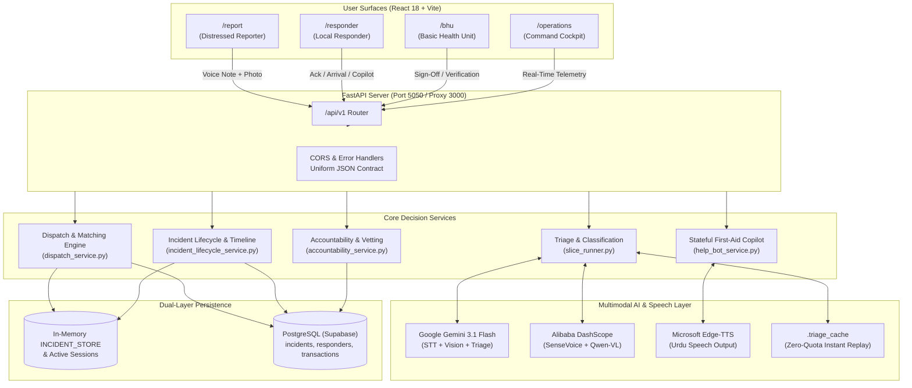

# LifeLine Ride (لائف لائن رائیڈ)

> **Urdu-First, AI-Powered Rural Emergency Response & Community Dispatch Network**  
> Connecting distressed villagers, trained local first responders, and rural health facilities (BHUs) in under 30 seconds.

[](https://www.python.org/)
[](https://fastapi.tiangolo.com/)
[](https://react.dev/)
[](https://www.typescriptlang.org/)
[](https://tailwindcss.com/)
[](https://supabase.com/)
[](https://deepmind.google/technologies/gemini/)
[](https://github.com/rany2/edge-tts)
[](https://leafletjs.com/)
[](#testing--verification)

---

## 📌 Overview

In rural Pakistan and across the Global South, professional ambulance services (e.g., Rescue 1122) often take **45 to 90+ minutes** to reach remote villages due to distance, unpaved roads, and difficult terrain. During severe trauma, heavy bleeding, or snakebites, victims lose critical life minutes before medical personnel arrive. Illiteracy, panic, and lack of cellular data also prevent bystanders from using conventional smartphone apps.

**LifeLine Ride** bridges this life-critical gap:
1. **Bystanders report emergencies in under 30 seconds** by simply recording an Urdu voice note or taking a photo.
2. **Multimodal AI triages injury severity** (minor, moderate, critical) using Google Gemini or Alibaba DashScope.
3. **An intelligent clinical rules dispatch engine** immediately mobilizes the nearest verified motorcycle/car community first responder and alerts the nearest Basic Health Unit (BHU).
4. **Responders receive hands-free spoken Urdu voice guidance** with step-by-step first-aid protocols that automatically escalate if the patient's condition deteriorates.
5. **BHU medical staff verify outcomes and sign off**, providing a fraud-proof accountability ledger without perverse gamified scoring.

---

## 🌟 Key Features

### 🎙️ 1. Urdu-First Multimodal AI Triage
- **Voice-to-Dispatch**: Transcribes spoken Urdu voice notes (`gemini-3.1-flash-lite` / `SenseVoice`), captures dialect nuances, and extracts medical distress signals.
- **Computer Vision Triage**: Inspects incident photos to identify severe bleeding, open fractures, burns, or snakebite puncture marks.
- **Fail-Safe Discipline**: Inaudible audio or blurry photos automatically default to a safe `moderate` tier with a `low_confidence_triage` flag rather than failing or halting dispatch.
- **Zero-Quota Offline Cache**: Includes pre-cached fixture matching (`.triage_cache`) enabling instantaneous, zero-API-cost demoing.

### ⚡ 2. Clinical Rules & Deterministic Dispatch Engine
- **Category A (Dual Dispatch)**: Critical emergencies (e.g., heavy arterial bleeding, cardiac arrest, snakebite) simultaneously alert nearest community responders, notify the BHU, and request an ambulance.
- **Category B (Single Dispatch)**: Moderate injuries dispatch a local responder while placing the BHU on standby.
- **Category C (Zero Dispatch)**: Minor conditions provide immediate localized self-care instructions.
- **Timeout Auto-Fallback**: If the assigned responder fails to acknowledge within the timeout window, the system automatically cascades down the village availability chain.

### 🩺 3. Hands-Free Urdu AI First-Aid Copilot & Help-Bot
- **High-Reliability Scripted Tree**: Dedicated decision branches for `heavy_bleeding`, `fracture_crush`, and `snakebite` where every spoken recommendation is validated and deterministic.
- **Conversational Copilot**: Responders can speak natural Urdu questions (*"خون بند نہیں ہو رہا"*) to receive immediate instructions.
- **Urdu TTS Audio Feedback**: Generates and plays audio replies via Microsoft Edge-TTS / Gemini TTS.
- **Mid-Incident Auto-Escalation**: Detecting worsening symptoms automatically upgrades the incident tier to `critical` and requests immediate ambulance transfer.

### 🛡️ 4. Fraud-Proof Accountability & Dual-Layer Persistence
- **No Gamified Scoring**: The previous points leaderboard was removed to eliminate perverse incentives (responders avoiding complex patients to maintain win streaks).
- **BHU Sign-Off Gate**: Performance records only accrue verified responses when formally confirmed by `bhu_staff`. Self-reported closures never inflate records.
- **Dual-Layer Persistence**: Memory-speed state synced with PostgreSQL (Supabase) via SQLAlchemy write-through.
- **Startup Reconciliation**: Recovers from server restarts by rehydrating active incidents, restoring responder statuses, and releasing orphaned "busy" locks.

### 🗺️ 5. Tamman / Talagang Pilot Geography
- Real geographic anchor centered on **Tamman & Talagang** (Chakwal District, Punjab, Pakistan).
- Mapped union councils, villages (Tamman, Dhermond, Multan Khurd, Patwali, Sangwala, Darot, Jasial, Kot Sarang, etc.), and local Basic Health Units (BHU-001 through BHU-005).
- Integrated Leaflet GIS map with realistic facility status and incident coordinates.

---

## 🖥️ Product Surfaces (The 5 Portals)

The application architecture enforces strict role separation across four operational portals, with an all-in-one operations command view for judges, admins, and evaluators:

| Route | Role / Portal | Description |
|---|---|---|
| `/` | **Role Gateway** | Public landing and language selection (Urdu `اردو` / English). Allows users to pick their operational persona. |
| `/report` | **Distressed Reporter** | Streamlined emergency reporting via voice recording, photo capture, or quick demo fixtures. Displays real-time 2.5s timeline status updates (Reported ➔ Dispatched ➔ Acknowledged ➔ En Route ➔ Arrived ➔ Closed). |
| `/responder` | **First Responder** | Duty availability toggle (`available`, `busy`, `offline`), incoming dispatch notifications with sound alert, navigation details, "I Have Arrived" check-in, and the hands-free Urdu AI first-aid copilot. |
| `/bhu` | **Health Facility (BHU)** | Clinic staff dashboard showing incoming emergency cases, severity indicators, ambulance status, verified outcome closure (`taken_to_bhu`, `referred_to_hospital`, etc.), and candidate responder onboarding sign-off. |
| `/operations` | **Operations Command Cockpit** | Master operator and evaluator cockpit displaying the synchronized multi-role feed alongside an interactive Leaflet pilot GIS map. |

---

## 🏗️ System Architecture



---

## ⚙️ Tech Stack

### Frontend
- **Framework**: [React 18](https://react.dev/) + [Vite 5](https://vitejs.dev/) + [TypeScript](https://www.typescriptlang.org/)
- **Styling**: [Tailwind CSS 3.4](https://tailwindcss.com/) (Custom emergency palette, HSL tokens, dark-mode cockpit aesthetic)
- **Typography**: Google Fonts ([Outfit](https://fonts.google.com/specimen/Outfit), [Inter](https://fonts.google.com/specimen/Inter), and [Noto Nastaliq Urdu](https://fonts.google.com/noto/specimen/Noto+Nastaliq+Urdu))
- **Mapping & GIS**: [Leaflet 1.9](https://leafletjs.com/) with custom SVG emergency markers
- **Audio & Media**: Web Audio API, MediaRecorder for live in-browser Urdu voice capture

### Backend
- **Framework**: [FastAPI](https://fastapi.tiangolo.com/) + [Uvicorn](https://www.uvicorn.org/) (Asynchronous ASGI server)
- **Data Validation**: [Pydantic v2](https://docs.pydantic.dev/) (Strict models with uniform `{code, message}` error contracts)
- **Database ORM**: [SQLAlchemy](https://www.sqlalchemy.org/) with PostgreSQL connection pooling (`pool_pre_ping=True`, `pool_recycle=300`)
- **Database Provider**: [Supabase PostgreSQL](https://supabase.com/)

### AI & Speech
- **Primary AI Provider**: Google GenAI SDK (`gemini-3.1-flash-lite` / `gemini-3.5-flash`) for Urdu STT, multimodal vision triage, and natural conversational copilot
- **Secondary AI Provider**: Alibaba DashScope (`SenseVoice-v1`, `qwen-vl-max`, `qwen-plus`)
- **Speech Synthesis**: Microsoft Edge-TTS (`ur-PK-AsadNeural` / `ur-PK-UzmaNeural`)

---

## 🚀 Quickstart & Installation

### Prerequisites
- **Python**: 3.10 or higher
- **Node.js**: 18.0 or higher (with `npm`)
- **Git**

---

### 1. Clone the Repository
```bash
git clone https://github.com/M-Rumman/LifeLine-Ride.git
cd LifeLine-Ride
```

---

### 2. Backend Setup
Create and activate a Python virtual environment, install dependencies, and start the FastAPI server:

```powershell
# In project root
python -m venv venv

# Windows PowerShell:
.\venv\Scripts\Activate.ps1
# macOS/Linux:
# source venv/bin/activate

# Install requirements
pip install -r backend/requirements.txt
```

Configure environment variables:
Create or check `.env` in the project root:
```env
PORT=5050
DATABASE_URL=postgresql://<user>:<password>@<host>:5432/<dbname>
GEMINI_API_KEY=your_google_gemini_api_key
GEMINI_FLASH_MODEL=gemini-3.1-flash-lite
GEMINI_CLASSIFIER_MODEL=gemini-3.1-flash-lite
# Optional alternative provider:
DASHSCOPE_API_KEY=your_dashscope_api_key
```

Run the backend server:
```powershell
python backend/main.py
```
> The backend boots on `http://localhost:5050` (or the port defined in `.env`), probes PostgreSQL connectivity, seeds initial responders, rehydrates active incidents, and reconciles availability.

Check backend health:
```bash
curl http://localhost:5050/health
```

---

### 3. Frontend Setup
In a separate terminal, install dependencies and start the Vite development server:

```powershell
cd frontend
npm install
npm run dev
```

> The Vite dev server will run on `http://localhost:3000`.  
> It automatically proxies `/api`, `/health`, and `/media` requests to `http://localhost:5050`, so no CORS configuration is required.

Open your browser and navigate to:
👉 **[http://localhost:3000](http://localhost:3000)**

---

## 📡 REST API Reference

All application endpoints live under `/api/v1` (with `/health` at root). Every error response strictly adheres to the project error contract:
```json
{
  "code": "ERROR_CODE_STRING",
  "message": "Human readable explanation"
}
```

### Core Endpoints

| Method | Endpoint | Description |
|---|---|---|
| `GET` | `/health` | Server liveness, DB connection status, active sessions, and active AI models. |
| `POST` | `/api/v1/emergency/upload` | Upload incident photos or audio voice clips. |
| `POST` | `/api/v1/emergency/triage/analyze` | Multimodal AI triage analysis (transcription + injury classification). |
| `POST` | `/api/v1/emergency/report` | Register incident, run triage, execute matching, and persist incident. |
| `GET` | `/api/v1/emergency/incidents` | Query active or historical incidents filtered by role or status. |
| `GET` | `/api/v1/emergency/incident/{id}` | Detailed incident record and audit log. |
| `GET` | `/api/v1/emergency/incident/{id}/timeline` | Lightweight 2.5s reporter polling feed with status and Urdu updates. |
| `POST` | `/api/v1/emergency/incident/{id}/close` | BHU or responder incident sign-off with verified outcome logging. |
| `GET` | `/api/v1/responders` | List registered responders, duty availability, and verification state. |
| `PUT` | `/api/v1/responders/{id}/status` | Update duty availability (`available`, `busy`, `offline`). |
| `POST` | `/api/v1/responder/respond` | Responder `accept` or `decline` action with fallback trigger. |
| `POST` | `/api/v1/responder/arrived` | Responder scene arrival check-in. |
| `POST` | `/api/v1/responder/chat` | Conversational Urdu AI First-Aid Copilot with TTS audio URL. |
| `POST` | `/api/v1/helpbot/step` | Deterministic stateful first-aid guidance turn and auto-escalation. |
| `POST` | `/api/v1/responders/register` | Register new candidate volunteer responder (starts unverified). |
| `POST` | `/api/v1/responders/{id}/verify` | BHU / trainer verification sign-off for candidate responders. |
| `GET` | `/api/v1/responders/pending` | List unverified candidate responders awaiting inspection. |
| `GET` | `/api/v1/accountability/responder/{id}/performance` | Auditable performance records (verified response times, outcomes). |

---

## 🧪 Testing & Verification

LifeLine Ride includes an extensive, enterprise-grade test suite of **338 automated test checks across 11 test suites**, validating everything from offline dispatch to process restart survival.

To run the test suites:

```powershell
# Module 3: Matching & Dispatch Engine (44 checks)
python backend/test_module3.py

# Module 5: Accountability & Fraud Prevention (39 checks)
python backend/test_module5.py

# Module 6: Incident Lifecycle & Outcomes (23 checks)
python backend/test_module6.py

# Module 6.5: PostgreSQL Persistence & Rehydration (33 checks)
python backend/test_module6_persistence.py

# Module 7: Responder Onboarding & Sign-off Gates (28 checks)
python backend/test_module7_onboarding.py

# Modules 8 & 9: Coverage Gaps & Reporter Timeline (34 checks)
python backend/test_module8_9.py

# Live HTTP API End-to-End Test (35 checks)
python backend/test_api_live.py

# Restart Survival & Availability Persistence (14 checks)
python backend/test_availability_persistence.py

# Startup Orphaned Responder Reconciliation (27 checks)
python backend/test_reconciliation.py

# Clinical Rules Engine Triage Matrix
python backend/test_clinical_rules_engine.py

# Conversational AI Copilot Test
python backend/test_responder_chat.py

# Frontend Typecheck & Smoke Tests
cd frontend
npm run typecheck
npm run smoke
```

---

## 🎬 Zero-Quota Demo & Evaluation Walkthrough

To experience the entire 12-step flow without consuming live Gemini API quota or requiring physical devices:

### Automated End-to-End Verification Run
Run the verification harness that exercises the identical HTTP lifecycle as the UI:
```powershell
python _verify_demo_flow.py
```

### Clean State Reset
If previous test runs left responders in a `busy` state:
```powershell
python _reset_demo_state.py
```

### Deterministic First-Aid Bot Replay
Test the Urdu first-aid help-bot offline with pre-recorded scenarios:
```powershell
python backend/help_bot_runner.py --simulate snakebite --mode replay mockdata/helpbot/scripts/snakebite.json
```

---

## 🗺️ Pilot Geography: Tamman / Talagang Network

The system is calibrated for the rural geography of Tehsil Talagang, Punjab:

```
                  [ BHU-001 Tamman ]
                          │
     ┌────────────────────┼────────────────────┐
     ▼                    ▼                    ▼
[ Tamman ]          [ Patwali ]          [ Dhermond ]
(VILLAGE-A)         (VILLAGE-A)          (VILLAGE-A)
Resp: RESP-01       Resp: RESP-02        Resp: RESP-03
Linked: BHU-001     Linked: BHU-005      Linked: BHU-003

                          │
     ┌────────────────────┴────────────────────┐
     ▼                                         ▼
[ Multan Khurd ]                         [ Jasial ]
(VILLAGE-B)                              (VILLAGE-B)
Resp: RESP-04                            Resp: RESP-05
Linked: BHU-004                          Linked: BHU-005
```

- **Localities**: Tamman, Dhermond, Multan Khurd, Patwali, Sangwala, Darot, Bedhar, Wanhar, Saghar, Budhial, Jasial, Kot Sarang, Jhatla.
- **Health Centers**: BHU Tamman, BHU Dhermond, BHU Multan Khurd, BHU Patwali.
- **Fail-Safe Locality Resolution**: Real locality IDs map dynamically to verified responder coverage groups (`VILLAGE-A`, `VILLAGE-B`) without losing the victim's precise coordinates.

---

## 📁 Repository Structure

```
LifeLine-Ride/
├── backend/                        # FastAPI Backend & Core Decision Stack
│   ├── models/                     # SQLAlchemy Models (Incident, Responder, Points)
│   ├── routes/                     # HTTP API Controllers (emergency.py)
│   ├── services/                   # Modular Business Logic
│   │   ├── triage_service.py       # Speech & Vision Triage
│   │   ├── dispatch_service.py     # Deterministic Matching & Timeout Fallback
│   │   ├── help_bot_service.py     # Urdu First-Aid Guidance & State Machine
│   │   ├── help_bot_content.py     # Scripted Urdu First-Aid Clinical Texts
│   │   ├── incident_lifecycle_service.py # State Transitions & Closure
│   │   ├── accountability_service.py     # Factual Performance Metrics
│   │   └── onboarding_service.py   # Responder Vetting & Sign-Off
│   ├── database.py                 # PostgreSQL Engine & Session Configuration
│   ├── geography.py                # Tamman Pilot Geography Registry
│   ├── main.py                     # App Entrypoint & Startup Reconciliation
│   ├── requirements.txt            # Python Dependencies
│   ├── slice_runner.py             # Multimodal AI Pipelines & Unified Incident Model
│   └── test_*.py                   # 11 Automated Test Suites
├── frontend/                       # React 18 + Vite + Tailwind Cockpit
│   ├── src/
│   │   ├── components/             # Reusable UI (Header, Modals, Status Badges)
│   │   ├── hooks/                  # Audio Recording & Device Hooks
│   │   ├── lib/                    # Geography Catalog & API Client Utilities
│   │   ├── state/                  # CockpitContext & Role-Based State
│   │   └── views/                  # The 5 Core Product Surfaces
│   │       ├── LandingView.tsx     # Role Gateway & Language Toggle
│   │       ├── ReporterView.tsx    # Emergency Registration & Live Tracker
│   │       ├── ResponderView.tsx   # Dispatch Alerts & Urdu AI Copilot
│   │       ├── BhuView.tsx         # BHU Triage Queue & Sign-Off
│   │       └── OperationsView.tsx  # Master Cockpit with Leaflet Map
│   ├── package.json
│   ├── tailwind.config.js
│   └── vite.config.ts
├── mockdata/                       # Demo Fixtures, TTS Audio Cache & Presets
│   ├── helpbot/                    # Scripted Replay Sequences
│   └── media/                      # Audio & Photo Test Presets (.triage_cache)
├── _verify_demo_flow.py            # Automated 12-Step Demo Verification Script
├── _reset_demo_state.py            # Demo Responder Availability Reset Utility
├── DEMO_SCRIPT.md                  # Hackathon 3-Minute Presentation Script
├── PROJECT.md                      # Detailed Engineering & Verification Report
└── README.md                       # This File
```

---

## 👥 Contributors & Acknowledgements

Developed with ❤️ for rural emergency healthcare access.
- Built for real-world impact in resource-constrained, multilingual rural environments.
- Designed in consultation with first-aid guidelines, rural Basic Health Unit operational workflows, and verified emergency protocols.
